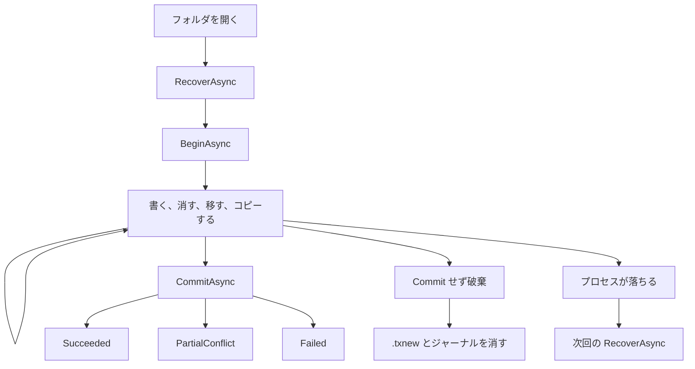
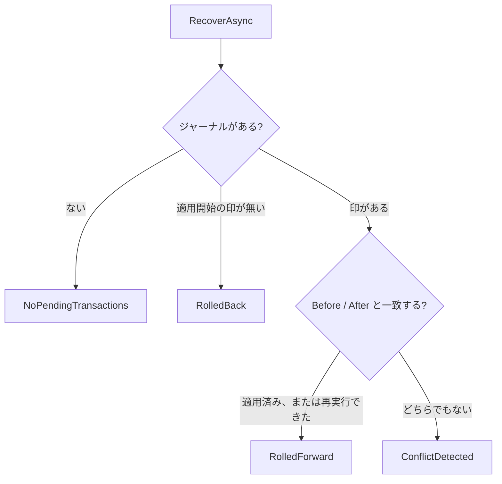

# Txfio

Windows の共有フォルダ（NTFS / SMB）で、コミットするまで本物のファイルを変えず、落ちたら復旧できるファイル IO ライブラリです。

nuget.org にはまだありません。このリポジトリを参照してビルドします。TFM は `net8.0` です。SMB サーバー自身のキャッシュがいつディスクへ落ちるかは保証しません。

契約の正本は [`docs/design.md`](docs/design.md) です。使う手順はこの README に書いてあります。

## はじめ方

ワークフォルダは既存のディレクトリです。アプリはフォルダを開くときに、先に `RecoverAsync` を呼びます。

```csharp
using Txfio;

await Txfio.RecoverAsync(@"D:\share\work");

await using ITransaction tx = await Txfio.BeginAsync(@"D:\share\work");
await tx.WriteAllTextAsync("a.txt", "hello");
CommitResult result = await tx.CommitAsync();
```

`CommitAsync` を呼ぶまでは、新しい内容を同じディレクトリの `.txnew` に置きます。本物のパスは変えません。確定は rename です。`CommitAsync` を呼ばずに破棄すると、その `.txnew` とジャーナルは消えます。

`CommitResult` は例外ではありません。

| 値                | 意味                                                 |
| ----------------- | ---------------------------------------------------- |
| `Succeeded`       | 予定どおり適用した                                   |
| `PartialConflict` | 適用の途中で外部干渉があった。確定は進んでいる       |
| `Failed`          | 適用前の検証で失敗した。本物のパスはまだ変えていない |

落ちたジャーナルは、次の `RecoverAsync` が戻すか進めます。結果は `NoPendingTransactions` / `RolledBack` / `RolledForward` / `ConflictDetected` です。

## できないこと

- ディレクトリの `ReadAsync`。渡すと `UnsupportedOperationException` です
- ボリュームをまたぐ `MoveAsync`。コピーと削除には切り替えません。ファイルなら `ImportAsync` と `ExportAsync` を明示的に使います
- 複数ファイルが、外から見て一時点で揃うこと。コミット中は、一部だけ新しい状態が見えます
- コミット開始後の取り消し。適用が始まったら最後まで進め、落ちた分は `RecoverAsync` の対象です
- SQL や DTC と同じトランザクションへの参加
- `CreateDirectoryAsync` したディレクトリの中を、Txfio の変更系で書くこと。中身は素のファイル API で書きます。同じプロセスでも別プロセスでもよいです。ファイルの読み取りと `ExportAsync` はできます
- 素のファイル API やエクスプローラーからの変更を防ぐこと。コミット前の `.txnew` も見えます
- Linux での動作保証

## 操作

呼んだ操作だけを追跡します。フォルダ全体の差分スキャンはしません。同期版はありません。

| API                                        | できること                                                                                                                       |
| ------------------------------------------ | -------------------------------------------------------------------------------------------------------------------------------- |
| `AddAsync` / `UpdateAsync`                 | ファイルの新規作成と置き換え。内容は `.txnew` へ書く。進捗は `TransferProgress`                                                  |
| `DeleteAsync`                              | ファイル、または直下だけのディレクトリの削除予約。実削除はコミット時                                                             |
| `DeleteTreeAsync`                          | ディレクトリとその配下すべての削除予約。ステージでは木を走査せず、コミット時に再帰削除する                                       |
| `MoveAsync`                                | 同一ボリューム内のファイルまたはディレクトリの移動予約。ディレクトリはコミット時に 1 回 rename し、中身は付いていく              |
| `AttachAsync`                              | 外部が作ったファイルまたはディレクトリを、コピーも rename もせず取り込む。ファイルはサイズと最終更新日時を記録し、ディレクトリは存在だけを記録する |
| `CreateDirectoryAsync`                     | 空ディレクトリを呼んだ時点で作る。中身は素のファイル API で書く。破棄ではそのディレクトリを中身ごと消す                                           |
| `CopyAsync`                                | ワークフォルダ内のファイルまたはディレクトリをコピーする。コピー元は残す。ディレクトリはファイルごとの Add と空ディレクトリ      |
| `ImportAsync`                              | ワークフォルダの外のファイルまたはディレクトリを `.txnew` へコピーし、Add として残す。コピー元は消さない                         |
| `ExportAsync`                              | 読み取りと同じバイトを、ワークフォルダの外へコピーする。ディレクトリは配下の各ファイル。ジャーナルには残さず、ロックもしない     |
| `ReadAsync`                                | `.txnew` があればそれ、無ければ本物のファイル。ロックは取らない                                                                  |
| `ReadAllTextAsync` / `ReadAllLinesAsync`   | 読み取りと同じバイトを文字列、または行の配列にする                                                                               |
| `WriteAllTextAsync` / `WriteAllLinesAsync` | ディスク上に無ければ Add、あれば Update。エンコーディングを省略した書き込みは BOM なし UTF-8                                       |
| `ReadFromJsonAsync` / `WriteAsJsonAsync`   | `System.Text.Json`。書き込みは上と同じ Add / Update。オプション省略時は既定の設定                                                 |
| `GetPendingChanges`                        | 未確定の操作一覧                                                                                                                 |
| `CommitAsync`                              | 検証してから rename と削除を適用する                                                                                             |
| `RecoverAsync`                             | 落ちたジャーナルを、マーカーの有無で戻すか進める                                                                                 |

親ディレクトリの自動作成はしません。`CopyAsync` と、ディレクトリの `ImportAsync` / `ExportAsync` だけ、コピー先のディレクトリ自身とその空のサブディレクトリを作ります。`CreateDirectoryAsync` は、対象の空ディレクトリだけを作り、親は作りません。メタデータフォルダ `.txfio` とその配下は操作できません。

## トランザクションの流れ

1 回のトランザクションは、復旧、開始、予約、終わり、の 4 段です。終わりはコミット、破棄、プロセスが落ちる、のどれかです。



`a.txt` を `old` から `new` に置き換える途中のディスクは、こうなっています。`{guid}` はそのトランザクションの ID です。

```text
D:\share\work\
  a.txt                          本物。まだ old
  a.txt.{guid}.txnew             新しい内容
  .txfio\
    tx-{guid}.journal            予約の一覧
    locks\                       Txfio 同士の協調ロック
```

エクスプローラーには `.txnew` が見えます。`File.ReadAllText` は本物の `old` を読みます。同じトランザクションの `ReadAllTextAsync` は `new` を読みます。

```csharp
await using ITransaction tx = await Txfio.BeginAsync(@"D:\share\work");
await tx.WriteAllTextAsync("a.txt", "new");
string staged = await tx.ReadAllTextAsync("a.txt"); // "new"
```

`GetPendingChanges` は、まだコミットしていない操作の一覧です。ディレクトリのコピーは、ファイルごとの Add として見えます。`CreateDirectoryAsync` はディレクトリ 1 件で、中のファイルは出ません。

### コミットすると

`CommitAsync` は、先に全部の前提を調べます。ここで失敗すると `Failed` で、本物のファイルはまだ変わっていません。

調べたあとに「適用開始」の印をジャーナルへ書き、そのあと本物を変えます。適用が始まったら、`CancellationToken` は無視して最後まで進めます。ここから先の中断は、落ちたあとの `RecoverAsync` の仕事です。

適用の順は、呼んだ順ではありません。

1. Add、Move、Attach、CreateDirectory
2. Update
3. Delete と DeleteTree。Delete はパスが深い方から

全部終わるとジャーナルを消します。`.txnew` は本物の名前へ rename されているので、残りません。

適用の途中で、ほかのプロセスがファイルを変えていたときは `PartialConflict` です。戻り値は例外ではありません。確定は進んでいます。`Succeeded` と見比べて扱ってください。

### コミットせず破棄すると

`await using` を抜ける、または `DisposeAsync` すると、未コミットの `.txnew`、コピーが作ったディレクトリ、`CreateDirectoryAsync` のディレクトリ、ジャーナルが消えます。`CreateDirectoryAsync` の中へ素のファイル API で書いたものも、そのディレクトリごと消えます。それ以外の、このトランザクションが触れていないファイルは残ります。Attach したファイルとディレクトリは消しません。

コミット開始前にキャンセルしたときも、破棄のときに同じ片付けをします。

### 落ちると

印を書く前に落ちたジャーナルは、次回 `RecoverAsync` がロールバックします。印を書いたあとに落ちたジャーナルは、ロールフォワードします。判断はライブラリがします。アプリはフォルダを開くときに `RecoverAsync` を 1 回呼びます。



`ConflictDetected` は、落ちたあとにだれかがファイルを変えていて、戻すことも進めることも安全にできないときです。

`RecoverAsync` は自動では走りません。開くたびに先に呼んでください。ディレクトリの全削除やディレクトリの移動のあと、残骸の `.txnew` が残っているかもしれないときも、先に呼びます。

## ファイルを書く

小さい文字列は `WriteAllTextAsync` です。ディスク上にファイルが無ければ Add、あれば Update です。未コミットの `.txnew` は「ディスク上のファイル」には数えません。

```csharp
await tx.WriteAllTextAsync("new.txt", "hello");   // Add
await tx.WriteAllTextAsync("a.txt", "replaced");   // 既存なら Update
await tx.WriteAllLinesAsync("lines.txt", new[] { "a", "b" });
```

`WriteAllLinesAsync` は各行のあとに `Environment.NewLine` を付けます。読み出した配列の要素に改行は含まれません。`contents` が null の `WriteAllLinesAsync` は `ArgumentNullException` です。`WriteAllTextAsync` の null は空のファイルとして書きます。

エンコーディングを省略した書きは BOM なし UTF-8、読みは BOM があればそれを使います。明示するときは `Encoding` を渡します。

同じトランザクションで同じパスへ続けて書くと、予約は 1 件のまま内容だけ置き換わります。新規のままなら Add、既存なら Update です。`DeleteAsync` のあとや `AttachAsync` のあとに書くと Update になります。別の種類へ畳めない組み合わせは `InvalidOperationException` で、メッセージは「このパスは既に別の操作でステージングされています」です。

JSON も同じ規則です。オプションを省略すると `System.Text.Json` の既定なので、プロパティ名はそのままです。

```csharp
sealed record Note(string Title);

await tx.WriteAsJsonAsync("note.json", new Note("hello"));
Note? note = await tx.ReadFromJsonAsync<Note>("note.json");
```

壊れた JSON は `JsonException` のままです。

大きいバイト列は文字列 API を使わず、ストリームを渡します。ストリームの破棄は呼び出し側です。ライブラリは中身をコピーするだけで、渡されたストリームは閉じません。

```csharp
await using FileStream content = File.OpenRead(@"D:\incoming\big.bin");
await tx.AddAsync("big.bin", content);
```

`AddAsync` はディスク上にファイルが無いとき、`UpdateAsync` はあるときです。逆だと `ExternalConflictException` です。親ディレクトリが無いときも同じ例外で、自動では作りません。

`AddAsync`、`UpdateAsync`、`CopyAsync`、`ImportAsync`、`ExportAsync` は、`IProgress<TransferProgress>` を受け取れます。81920 バイト書くたびに通知します。空の内容は最後に 1 回、0 バイトです。ディレクトリのコピーは全体サイズを事前に測らないので、`TotalBytes` は null です。null の progress は通知しません。Delete、DeleteTree、Move、Attach、CreateDirectory、Commit に進捗はありません。

## ファイルを読む

`ReadAsync` は位置 0 の読み取りストリームを返します。破棄は呼び出し側です。ロックは取りません。`.txnew` も本物も無いときは `ExternalConflictException` です。ディレクトリは `UnsupportedOperationException` です。

Delete の予約、Attach、Move の移動元は、ステージされた新しいバイトが無いので本物を読みます。

ストリームを閉じる前でも、コミットの rename は進みます。同じパスを、ストリームを開いたまま書き直すと失敗することがあります。

## 消す、移す、外部のファイルを取り込む

削除と移動は予約だけです。ディスクが変わるのはコミットのときです。

ファイルを消すのは `DeleteAsync` です。ディレクトリの `DeleteAsync` は直下だけを見ます。空なら 1 回で予約できます。直下に、このトランザクションの削除予約、Add の取り消し、ディレクトリの外への Move のどれでもない子があると、`ExternalConflictException` になり、メッセージは「ディレクトリの直下に未予約の子があります」です。次のような木を直下だけで消すときは、深い方から予約します。

```text
tree/
  child/
    a.txt
```

```csharp
await tx.DeleteAsync("tree/child/a.txt");
await tx.DeleteAsync("tree/child");
await tx.DeleteAsync("tree");
CommitResult result = await tx.CommitAsync();
```

配下を 1 回で消すときは `DeleteTreeAsync` です。ジャーナルはディレクトリ 1 件で、ステージでは木を歩きません。コミット時に再帰削除します。配下にこのトランザクションの操作があると `InvalidOperationException` です。ファイルを渡すと `UnsupportedOperationException` です。ワークフォルダ自身は消せません。中の残骸も消すので、呼び側は先に `RecoverAsync` します。

```csharp
await tx.DeleteTreeAsync("tree");
```

`MoveAsync("tree", "archive")` は、コミット時にディレクトリを 1 回 rename します。中身はジャーナルに書かずに付いていきます。同じボリュームだけです。移動元と移動先の配下への操作、自分自身の配下への移動は `InvalidOperationException` です。

ほかのプロセスがすでに置いたファイルを、「Txfio が作った」と誤ってロールバック時に消したくないときは `AttachAsync` です。ファイルには触れません。Attach 時点のサイズと最終更新日時がコミットまでに変わっていると、そのコミットは `Failed` です。ディレクトリの Attach は存在だけを記録し、子の追加、変更、削除は見ません。ロールバックでもディレクトリは消しません。そのディレクトリ自身の `DeleteAsync` は直下削除に、`DeleteTreeAsync` は全削除に、`MoveAsync` はディレクトリ Move に畳みます。

## コピーする

3 つのコピーは、どれも rename やハードリンクにはしません。ジャンクションとシンボリックリンクは辿りません。ファイルのシンボリックリンクを直接渡すと `InvalidOperationException` で、メッセージは「シンボリックリンクはコピーできません」です。

| API           | どこから           | どこへ             | ジャーナル       | コピー元 |
| ------------- | ------------------ | ------------------ | ---------------- | -------- |
| `CopyAsync`   | ワークフォルダの中 | ワークフォルダの中 | 各ファイルが Add | 残る     |
| `ImportAsync` | ワークフォルダの外 | ワークフォルダの中 | 各ファイルが Add | 残る     |
| `ExportAsync` | ワークフォルダの中 | ワークフォルダの外 | 残さない         | 残る     |

```csharp
await tx.CopyAsync("src", "dest");
await tx.ImportAsync(@"D:\incoming\drop", "imported");
await tx.ExportAsync("src", @"D:\outgoing\copy");
```

ディレクトリは、ディスク上のファイルを 1 つずつコピーします。空のサブディレクトリも作ります。未コミットの Add は本物の名前でディスクに無いので、ディレクトリのコピーにも Export にも含まれません。Update 済みのファイルを Export すると、出るのは `.txnew` の新しい内容です。ディスク上の本物は古いままです。

コピー先にファイルかディレクトリがある、または親が無いときは `ExternalConflictException` です。上書きしません。同じパス、コピー先がコピー元の配下、予定された `DeleteTree` の配下へのコピーは `InvalidOperationException` です。

`CopyAsync` と `ImportAsync` の失敗、取り消し、未コミットの破棄では、作りかけの `.txnew` と、その操作が作ったディレクトリを消します。コミットすると、作ったディレクトリは残ります。`ExportAsync` はワークフォルダを変えないので、成功したコピー先は破棄しても残ります。失敗や取り消しでは、外に作りかけたものを消します。

## 空ディレクトリを作る

`CreateDirectoryAsync` だけは、呼んだ時点で本物のパスに空ディレクトリを作ります。中身は素のファイル API で書きます。同じプロセスでも別プロセスでもよいです。ジャーナルはディレクトリ 1 件で、中は走査しません。

```csharp
await using ITransaction tx = await Txfio.BeginAsync(@"D:\share\work");
await tx.CreateDirectoryAsync("drop");
await File.WriteAllTextAsync(@"D:\share\work\drop\a.txt", "from-api");
CommitResult result = await tx.CommitAsync();
```

コミットが `Succeeded` なら、`drop` と `a.txt` はその場所に残ります。rename はしません。コミットせず破棄すると、`drop` も `a.txt` も消えます。

そのディレクトリ自身と配下への Add、Update、Delete、DeleteTree、Move、Copy、Import、Attach、入れ子の `CreateDirectoryAsync` は `InvalidOperationException` です。ファイルの `ReadAsync` と、ファイルまたはディレクトリの `ExportAsync` はできます。兄弟の `CreateDirectoryAsync` と、木の外の操作は続けられます。

既にあるパス、親が無いパスは `ExternalConflictException` です。コミットの前にディレクトリが無い、またはファイルに変わっていると `Failed` です。そのファイルは破棄しても残ります。

## 同時に使う

このロックは、Txfio の利用者同士の協調です。素の `File` API やエクスプローラーは止めません。

変更系（Add、Update、Delete、DeleteTree、Move、Attach、Copy、Import）は、パスを押さえる前にワークフォルダの哨兵を取り、トランザクションが終わるまで持ちます。ふだんの哨兵は共有なので、別のパスを触るトランザクションは並行できます。

ディレクトリの Move、`DeleteTreeAsync`、ディレクトリの `CopyAsync`、ディレクトリの `ImportAsync`、`CreateDirectoryAsync` のあいだだけ、哨兵は排他です。そのあいだ、同じワークフォルダのほかの変更は `LockContentionException` になります。待たずに失敗します。`Path` には、押さえられていたパスが 1 つ入っています。ワークフォルダ全体を押さえているときは、そのパスがワークフォルダです。どの操作がどのロックを取るかは、次の節の表です。

`ReadAsync` と `ExportAsync` はロックしません。

プロセスが落ちると、OS がロックのハンドルを閉じます。`.lock` ファイルは残します。`RecoverAsync` はロックを開きも消しもしません。

## 操作ごとの分岐

呼んだ操作がディスクに何を残すか、どこで失敗するか、ロック、再ステージ、復旧はここを見ます。例外の型の一覧は次の節です。

### ディスク

| 操作 | 対象 | 呼んだ直後 | コミット後 | 破棄で消える |
| --- | --- | --- | --- | --- |
| `AddAsync` | ファイル | `.txnew` だけ。本物は無い | 本物のパスへ rename | `.txnew` |
| `UpdateAsync` | ファイル | `.txnew`。本物は旧内容 | 本物を置換 | `.txnew`。本物は旧のまま |
| `DeleteAsync` | ファイル | 予約だけ。本物は残る | 消える | 何も消さない |
| `DeleteAsync` | 空にできるディレクトリ | 予約だけ。本物は残る | 直下だけを消す | 何も消さない |
| `DeleteTreeAsync` | ディレクトリ | 予約だけ。木は残る | 中身ごと消す | 何も消さない |
| `MoveAsync` | ファイル、ディレクトリ | 予約だけ。元に残る | 1 回 rename。中身は付いていく | 何も消さない |
| `AttachAsync` | ファイル、ディレクトリ | 触らない | 検証が通れば残す | 消さない |
| `CreateDirectoryAsync` | ディレクトリ | 空ディレクトリをその場で作る | その場所に残す。中身も残す | そのディレクトリを中身ごと |
| `CopyAsync` / `ImportAsync` | ファイル | 先の `.txnew`。元は残る | 先が本物。元は残る | `.txnew` |
| `CopyAsync` / `ImportAsync` | ディレクトリ | 先のディレクトリ、空のサブディレクトリ、各ファイルの `.txnew`。元は残る。未コミットの Add は含まれない | 先が残る。元は残る | `.txnew` と、その操作が作ったディレクトリ |
| `ExportAsync` | ファイル、ディレクトリ | 外へコピー。ジャーナルには残さない | コミットは外を変えない | 成功したコピーは残る。作りかけは失敗と取り消しで消す |
| 読み取り | ファイル | 変えない | 変えない | 消えない |

`WriteAllTextAsync`、`WriteAllLinesAsync`、`WriteAsJsonAsync` は、ディスク上にファイルが無ければ Add、あれば Update です。未コミットの `.txnew` はディスク上のファイルに数えません。

### 主な失敗

| 操作 | 失敗 |
| --- | --- |
| `AddAsync` | 既にある、親が無い → `ExternalConflictException` |
| `UpdateAsync` | 無い、親が無い → `ExternalConflictException` |
| `DeleteAsync`（ファイル） | 無い → `ExternalConflictException` |
| `DeleteAsync`（ディレクトリ） | 直下に未予約の子 → `ExternalConflictException`。ファイルへすり替わるとコミットは `Failed` |
| `DeleteTreeAsync` | ファイル → `UnsupportedOperationException`。配下にこのトランザクションの操作 → `InvalidOperationException` |
| `MoveAsync` | 別ボリューム → `UnsupportedOperationException`。元が無い、先がある → `ExternalConflictException`。配下や自分自身の配下 → `InvalidOperationException` |
| `AttachAsync`（ファイル） | 無い → `ExternalConflictException`。サイズか最終更新日時が変わるとコミットは `Failed` |
| `AttachAsync`（ディレクトリ） | 無い、またはファイルだとコミットは `Failed` |
| `CreateDirectoryAsync` | 既にある、親が無い → `ExternalConflictException`。自身と配下の変更系 → `InvalidOperationException`。コミット時に無い、またはファイル → `Failed` |
| `CopyAsync` / `ImportAsync` | 先が塞がっている、親が無い → `ExternalConflictException`。シンボリックリンク、同一パス、配下 → `InvalidOperationException`。Import の元がワークフォルダの中 → `ArgumentException` |
| `ExportAsync` | 先がワークフォルダの中 → `ArgumentException`。先が塞がっている、親が無い、元が無い → `ExternalConflictException` |
| `ReadAsync` | ディレクトリ → `UnsupportedOperationException`。`.txnew` も本物も無い → `ExternalConflictException` |
| 共通 | `.txfio` 配下 → `InvalidOperationException`。ワークフォルダの外 → `ArgumentException`。ほかの Txfio が押さえている → `LockContentionException` |

ワークフォルダ自身を `CreateDirectoryAsync`、`DeleteAsync`、`DeleteTreeAsync` の対象にすると `ArgumentException` で、メッセージは「パスはワークフォルダの内側である必要があります」です。

### ロック

| 操作 | 哨兵 | パス |
| --- | --- | --- |
| Add、Update、ファイルの Delete、ファイルの Move、ファイルの Attach、ファイルの Copy、ファイルの Import | 共有。別パスは並行できる | 名指ししたパス。Move とファイルの Copy は元と先。ファイルの Import は先だけ |
| ディレクトリの Delete、ディレクトリの Attach | 共有 | そのディレクトリだけ。子はロックしない |
| `DeleteTreeAsync`、ディレクトリの Move、ディレクトリの Copy、ディレクトリの Import、`CreateDirectoryAsync` | 排他。ほかの変更は `LockContentionException` | 対象。Move は元と先。ディレクトリの Copy は元と先で、子はロックしない。ディレクトリの Import は先だけ。`CreateDirectoryAsync` はそのディレクトリ |
| `ReadAsync`、`ExportAsync` | 取らない | 取らない |

### 再ステージ

同じパスへ続けて呼んだとき、予約は次のように畳みます。畳めない組み合わせは `InvalidOperationException` で、メッセージは「このパスは既に別の操作でステージングされています」です。

| すでに予約がある | 続けて呼ぶ | 残る予約 |
| --- | --- | --- |
| Add | 同じパスへ書く、または Update | Add のまま。内容だけ置き換わる |
| Update | 同じパスへ書く、または Update | Update |
| Delete | 書く、Add、Update | Update |
| ファイルの Attach | 書く、または Update | Update |
| ディレクトリの Attach | `DeleteAsync` | 直下の Delete |
| ディレクトリの Attach | `DeleteTreeAsync` | DeleteTree |
| ディレクトリの Attach | `MoveAsync` | ディレクトリの Move |
| Move | 先へ Update | 先の Add と、元の Delete |
| Move | 元または先の Delete | 元の Delete。ディレクトリの Delete は直下の規則のまま |
| Move | 続けて Move | 最初の元から最後の先への Move |
| ディレクトリの Move | 元または先そのものの `DeleteTreeAsync` | Move を消し、元ディレクトリの DeleteTree |
| `CreateDirectory` | そのディレクトリ自身と配下の変更系 | 畳まない |

`DeleteTreeAsync` の配下への操作、ディレクトリ Move の移動元と移動先の配下への操作も、同じ例外です。

### 復旧

「落ちると」の図は、ジャーナル全体の分岐です。操作ごとに戻すものと進めるものは違います。

| 操作 | 印が無い | 印があり、進める | 競合 |
| --- | --- | --- | --- |
| Add、Update | `.txnew` を消す。本物は触らない | After と一致すればスキップ。Before と一致すれば再実行 | どちらでもない |
| Delete、DeleteTree | 予約だけなのでディスクは変えない | 残っていれば再実行。消えていれば適用済み。ファイルなら競合 | Before にも After にも一致しない |
| Move | 予約だけなのでディスクは変えない | After と一致すればスキップ。Before と一致すれば再実行 | どちらでもない |
| Attach | 消さない | After と一致すればスキップ | サイズ、日時、存在が一致しない。ディレクトリがファイルでも競合 |
| `CreateDirectory` | ディレクトリを中身ごと消す。無ければ何もしない | ディレクトリがあれば残して進める。作り直さない | 無い、またはファイル |
| `ExportAsync` | ジャーナルに無い。成功した外のコピーは残る | 復旧の対象外 | 復旧の対象外 |

削除に失敗した例外は呼び出し側へ届きます。ジャーナルが残っていれば、次の `RecoverAsync` が同じ削除をします。

## 例外の見分け

コミットの成否は例外にしません。`CommitResult` を見てください。それ以外の失敗は例外です。基底は `TxfioException` です。

| 状況                                                                                  | 型                              |
| ------------------------------------------------------------------------------------- | ------------------------------- |
| 対象が無い、既にある、親が無い、直下に予定外の子がある、コピー先が塞がっている        | `ExternalConflictException`     |
| ディレクトリの読み取り、ファイルへの `DeleteTreeAsync`、ボリュームをまたぐ Move       | `UnsupportedOperationException` |
| 別操作でステージング済み、自分自身の配下への Move や Copy、シンボリックリンクのコピー | `InvalidOperationException`     |
| パスがワークフォルダの外、Import の元が中、Export の先が中                            | `ArgumentException`             |
| ほかの Txfio がパスまたはワークフォルダを押さえている                                 | `LockContentionException`       |
| JSON として読めない                                                                   | `JsonException`                 |

`ExternalConflictException` と `LockContentionException` は、失敗したパスを 1 つ持ちます。

## TxFileManager と SQLite

- **Txfio**（このライブラリ）
- **[TxFileManager](https://github.com/chinhdo/txFileManager)**（NuGet `TxFileManager`）。`System.Transactions` にファイル操作を参加させるライブラリです。Windows の TxF ではありません。TxF は Microsoft が非推奨としており、このライブラリは採用していません
- **データを SQLite に置く使い方**。ファイルツリーの代わりに、行や BLOB を 1 つのデータベースファイルへ入れます

### 有利なとき

本物のファイルを、遅いファイルサーバー上に残したいときです。コミットは再コピーではなく rename で、ディレクトリの移動は子を走査しません。ジャーナルはワークフォルダに残るので、プロセスが落ちても `RecoverAsync` で片付けられます。大きなディレクトリの移動や `DeleteTreeAsync` で、一時フォルダへの退避コピーを避けられます。

### 不利なとき

SQL の INSERT とファイル作成を、落ちても両方戻る 1 つのトランザクションにしたいときです。それは TxFileManager と `TransactionScope` の領域で、このライブラリは参加しません。ただし TxFileManager 側には、落ちたあとのファイル復旧がありません。

確定後も普通のファイルである必要がなく、検索や同時読み取りの一貫性が欲しいときは、SQLite の方が単純です。共有フォルダ上の既存ツールがファイルを直接開く必要があるなら、SQLite へ入れると利用者がファイルを扱えなくなります。

コミットの途中で他プロセスから見て中間状態が許されないときも向きません。複数ファイルの反映は 1 操作ずつです。`.txnew` が見えること、素のファイル API がロックを無視することも、許容できないなら向きません。

| 観点                      | Txfio                                                                                                         | TxFileManager                                                                    | SQLite にデータを置く                                             |
| ------------------------- | ------------------------------------------------------------------------------------------------------------- | -------------------------------------------------------------------------------- | ----------------------------------------------------------------- |
| 確定後に残るもの          | 普通のファイルとディレクトリ                                                                                  | 普通のファイルとディレクトリ                                                     | データベースファイル。個別ファイルにはならない                    |
| いつ見えるか              | コミットまで本物のパスは旧状態。`.txnew` は見える                                                             | 呼んだ瞬間に反映される。分離は Read Uncommitted                                  | 他接続からは、コミット済みの状態が見える                          |
| クラッシュ                | ジャーナルが残る。`RecoverAsync` が戻すか進める                                                               | 復旧は揮発。落ちると途中のファイル操作が残る                                     | DB はジャーナルまたは WAL で復旧する。DB の外のファイルは含まない |
| 複数対象の揃い            | コミット中は一部だけ新しい。`Failed` は本物を変えない                                                         | 変更は即時に見える。複数ファイルの Move のロールバックが途中で止まった報告がある | DB 内の変更は 1 つのコミットに揃う                                |
| ディレクトリ全削除        | `DeleteTreeAsync`。ステージでは走査せず、コミット時に再帰削除。`DeleteAsync` は直下だけ                       | `DeleteDirectory`。実行時点で temp へ退避する                                    | パスを表す行を SQL で消す。ファイルツリーの削除ではない           |
| ディレクトリの取り込み    | `AttachAsync` は存在だけ。子の変化は見ない。ロールバックでも消さない                                          | ディレクトリを「作ったことにしない」専用 API は無い                              | 行として入れるならアプリが書く                                    |
| ディレクトリの移動        | 同一ボリュームで 1 回の rename。ボリューム跨ぎはエラー                                                        | `MoveDirectory`。即時。temp が別ボリュームだとコピーと削除になる                 | パス列の更新                                                      |
| 一時置き場                | 使わない。`.txnew` は同じディレクトリ                                                                         | 既定は `Path.GetTempPath()`                                                      | データベースファイル自身                                          |
| SMB 上の共有              | 対象。サーバーキャッシュの永続化は保証外                                                                      | 設計の主対象ではない                                                             | ネットワーク共有に置く使い方はサポート外                          |
| DB と同じトランザクション | 参加しない                                                                                                    | `TransactionScope` で参加できる                                                  | データベースの中だけ                                              |
| 同時実行                  | 利用者間はパス単位。ディレクトリ Move、全削除、ディレクトリコピー、ディレクトリの Import、`CreateDirectoryAsync` のあいだは哨兵が排他 | スレッドセーフと README にある。分離は Read Uncommitted                          | 書き込みは原則 1 接続。読み取りは WAL などで並行できる            |
| 素の File API             | 止められない                                                                                                  | 止められない                                                                     | DB を経由しない読み書きはトランザクションの外                     |
| プラットフォーム          | 保証は Windows                                                                                                | .NET Standard 2.0。Windows と Ubuntu でテストされている                          | クロスプラットフォーム                                            |
| API の形                  | 非同期のみ。コピーの進捗あり                                                                                  | 同期が中心                                                                       | `Microsoft.Data.Sqlite` なら同期と非同期                          |

TxFileManager の機能一覧は、公開 README と `DeleteDirectoryOperation`（ディレクトリを temp へ移し、ロールバックで戻し、確定後に temp を再帰削除する）に基づきます。作者は揮発エンリストだけをサポートし、プロセスが落ちると途中のまま残ると説明しています。SQLite をネットワークファイルシステム上に置くことは、SQLite 作者が確実な動作の対象外としています。

## ドキュメント

| 文書                                         | 役割                 |
| -------------------------------------------- | -------------------- |
| [`docs/design.md`](docs/design.md)           | 設計の正本           |
| [`docs/roadmap.md`](docs/roadmap.md)         | 実装順（Phase は仮） |
| [`docs/conventions.md`](docs/conventions.md) | コーディング規約     |
| [`CONTRIBUTING.md`](CONTRIBUTING.md)         | 進め方               |
| [`SECURITY.md`](SECURITY.md)                 | 脆弱性の報告         |

## ローカル検証

Windows では `./build.ps1` がゲートです。Linux ではこのスクリプトを実行せず、restore / format / build までにします。

```powershell
./build.ps1
```

## ライセンス

[MIT](LICENSE)
