# Txfio

Windows の共有フォルダ（NTFS / SMB）で、コミットするまで本物のファイルを変えず、落ちたら復旧できるファイル IO ライブラリです。

nuget.org にはまだありません。このリポジトリを参照してビルドします。TFM は `net8.0` です。SMB サーバー自身のキャッシュがいつディスクへ落ちるかは保証しません。

契約の正本は [`docs/design.md`](docs/design.md) です。使う手順はこの README に書いてあります。

## はじめ方

ワークフォルダは既存のディレクトリです。アプリはフォルダを開くときに、先に `RecoverAsync` を呼びます。

```csharp
using Txfio;

await Txfio.RecoverAsync(@"D:\share\work");

await using ITransaction tx = await Txfio.BeginAsync(@"D:\share\work");
await tx.WriteAllTextAsync("a.txt", "hello");
CommitReport report = await tx.CommitAsync();
```

`CommitAsync` を呼ぶまでは、新しい内容を同じディレクトリの `.txnew` に置きます。本物のパスは変えません。確定は rename です。`CommitAsync` を呼ばずに破棄すると、その `.txnew` とジャーナルは消えます。

`CommitReport.Result` は例外ではありません。成功のとき `Operations` は空です。`Failed` は検証で拒んだ操作、`PartialConflict` は適用で飛ばした操作を、パスと理由つきで載せます。

| 値                | 意味                                                 |
| ----------------- | ---------------------------------------------------- |
| `Succeeded`       | 予定どおり適用した                                   |
| `PartialConflict` | 適用の途中で外部干渉があった。確定は進んでいる       |
| `Failed`          | 適用前の検証で失敗した。本物のパスはまだ変えていない |

落ちたジャーナルは、次の `RecoverAsync` が戻すか進めます。`RecoverReport.Result` は `NoPendingTransactions` / `RolledBack` / `RolledForward` / `ConflictDetected` / `JournalUnreadable` です。処理したジャーナルは `Journals` に、パスの大文字小文字を無視した辞書順で載ります。`ConflictDetected` のときは、飛ばした操作もそこに載ります。別のプロセスやこのプロセスで生きているトランザクションのジャーナルには触れず、`Journals` にも入れません。落ちたジャーナルが残っているあいだ、`BeginAsync` と `CommitAsync` は `RecoveryRequiredException` です。JSON として読めないジャーナルは消さないので、直すか消すまで同じ例外のままです。

## できないこと

- ディレクトリの `ReadAsync`。渡すと `UnsupportedOperationException` です
- ZIP 以外のアーカイブ（tar、GZip 単体など）。ZIP の作成と展開では、既存のファイルへの上書きや、既存のディレクトリへの展開もしません
- ボリュームをまたぐ `MoveAsync`。コピーと削除には切り替えません。ファイルなら `ImportAsync` と `ExportAsync` を明示的に使います
- 複数ファイルが、外から見て一時点で揃うこと。コミット中は、一部だけ新しい状態が見えます
- コミット開始後の取り消し。適用が始まったら最後まで進め、落ちた分は `RecoverAsync` の対象です
- SQL や DTC と同じトランザクションへの参加
- 素のファイル API やエクスプローラーからの変更を防ぐこと。コミット前の `.txnew` も見えます
- Linux での動作保証

## 操作

呼んだ操作だけを追跡します。フォルダ全体の差分スキャンはしません。同期版はありません。

| API                                        | できること                                                                                                                                         |
| ------------------------------------------ | -------------------------------------------------------------------------------------------------------------------------------------------------- |
| `AddAsync` / `UpdateAsync`                 | ファイルの新規作成と置き換え。内容は `.txnew` へ書く。進捗は `TransferProgress`                                                                    |
| `DeleteAsync`                              | ファイル、または直下だけのディレクトリの削除予約。実削除はコミット時                                                                               |
| `DeleteTreeAsync`                          | ディレクトリとその配下すべての削除予約。ステージでは木を走査せず、コミット時に再帰削除する                                                         |
| `MoveAsync`                                | 同一ボリューム内のファイルまたはディレクトリの移動予約。ディレクトリはコミット時に 1 回 rename し、中身は付いていく                                |
| `CreateDirectoryAsync`                     | 空ディレクトリを呼んだ時点で作る。配下は通常の操作ができる。破棄ではそのディレクトリを中身ごと消す                                                 |
| `CopyAsync`                                | ワークフォルダ内のファイルまたはディレクトリをコピーする。コピー元は残す。ディレクトリはファイルごとの Add と空ディレクトリ                        |
| `ImportAsync`                              | ワークフォルダの外のファイルまたはディレクトリを `.txnew` へコピーし、Add として残す。コピー元は消さない                                           |
| `ExportAsync`                              | 読み取りと同じバイトを、ワークフォルダの外へコピーする。ディレクトリは配下の各ファイル。ジャーナルには残さず、ロックもしない                       |
| `CreateArchiveAsync`                       | ワークフォルダ内のファイルかディレクトリ、または元と名前の組の列から ZIP を作り、Add として残す               |
| `ExportArchiveAsync`                       | 読み取りと同じバイトで、ワークフォルダの外に ZIP を作る。ジャーナルには残さず、ロックもしない                                                      |
| `ExtractArchiveAsync`                      | ワークフォルダ内の ZIP を新しいディレクトリへ展開し、各ファイルを Add として残す                                                                   |
| `ImportArchiveAsync`                       | ワークフォルダの外の ZIP を新しいディレクトリへ展開し、各ファイルを Add として残す。ZIP は消さない                                                 |
| `ReadAsync`                                | コミット後の姿のファイルを開く。ロックは取らない                                                                                                   |
| `ExistsAsync`                              | コミット後の姿で、ファイルかディレクトリがあるかを返す。ロックは取らない                                                                           |
| `ReadAllTextAsync` / `ReadAllLinesAsync`   | 読み取りと同じバイトを文字列、または行の配列にする                                                                                                 |
| `WriteAllTextAsync` / `WriteAllLinesAsync` | コミット後の姿でファイルが無ければ Add、あれば Update。エンコーディングを省略した書き込みは BOM なし UTF-8                                        |
| `ReadFromJsonAsync` / `WriteAsJsonAsync`   | `System.Text.Json`。書き込みは上と同じ Add / Update。オプション省略時は既定の設定                                                                  |
| `GetPendingChanges`                        | 未確定の操作一覧                                                                                                                                   |
| `CommitAsync`                              | 検証してから rename と削除を適用する。結果は `CommitReport`                                                                                        |
| `RecoverAsync`                             | 落ちたジャーナルを、マーカーの有無で戻すか進める。結果は `RecoverReport`                                                                          |

親ディレクトリの自動作成はしません。`CopyAsync` と、ディレクトリの `ImportAsync` / `ExportAsync` だけ、コピー先のディレクトリ自身とその空のサブディレクトリを作ります。`ExtractArchiveAsync` / `ImportArchiveAsync` も、展開先のディレクトリ自身とエントリにあるディレクトリを作ります。`CreateDirectoryAsync` は、対象の空ディレクトリだけを作り、親は作りません。メタデータフォルダ `.txfio` とその配下は操作できません。

## トランザクションの流れ

1 回のトランザクションは、復旧、開始、予約、終わり、の 4 段です。終わりはコミット、破棄、プロセスが落ちる、のどれかです。

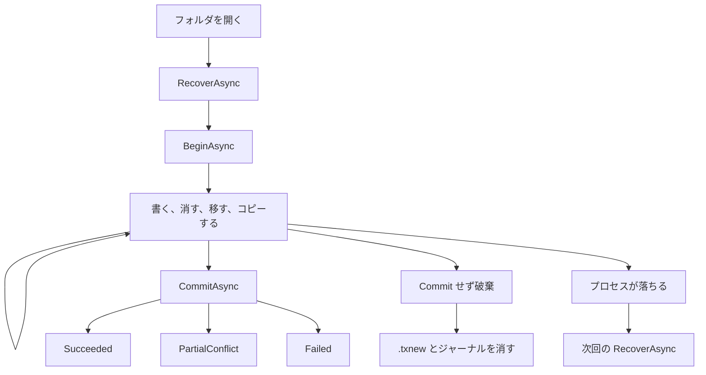

`a.txt` を `old` から `new` に置き換える途中のディスクは、こうなっています。`{guid}` はそのトランザクションの ID です。

```text
D:\share\work\
  a.txt                          本物。まだ old
  a.txt.{guid}.txnew             新しい内容
  .txfio\
    tx-{guid}.journal            予約の一覧
    locks\                       Txfio 同士の協調ロック
```

エクスプローラーには `.txnew` が見えます。`File.ReadAllText` は本物の `old` を読みます。同じトランザクションの `ReadAllTextAsync` は `new` を読みます。

```csharp
await using ITransaction tx = await Txfio.BeginAsync(@"D:\share\work");
await tx.WriteAllTextAsync("a.txt", "new");
string staged = await tx.ReadAllTextAsync("a.txt"); // "new"
```

`GetPendingChanges` は、まだコミットしていない操作の一覧です。ディレクトリのコピーは、ファイルごとの Add として見えます。`CreateDirectoryAsync` の配下で予約した操作は出ます。素のファイル API で書いたファイルは出ません。

### コミットすると

`CommitAsync` は、先に全部の前提を調べます。ここで失敗すると `Failed` で、本物のファイルはまだ変わっていません。

調べたあとに「適用開始」の印をジャーナルへ書き、そのあと本物を変えます。適用が始まったら、`CancellationToken` は無視して最後まで進めます。ここから先の中断は、落ちたあとの `RecoverAsync` の仕事です。

適用の順は、呼んだ順ではありません。

1. Add、Move、CreateDirectory
2. Update
3. Delete と DeleteTree。Delete はパスが深い方から

全部終わるとジャーナルを消します。`.txnew` は本物の名前へ rename されているので、残りません。

適用の途中で、ほかのプロセスがファイルを変えていたときや、ファイルを開けなかったときは `PartialConflict` です。戻り値は例外ではありません。確定は進んでいます。適用しなかった操作の `.txnew` とジャーナルは消えます。飛ばした操作は `Operations` に載ります。理由は、Before と After のどちらとも一致しない、対象が無い、移動先が既にある、ファイルかディレクトリにすり替わった、共有違反、それ以外の IO 失敗、です。共有違反は自動では再試行しません。同じインスタンスではやり直せません。`Succeeded` と見比べて扱ってください。

検証で失敗したときは `Failed` です。拒んだ操作は `Operations` に載ります。理由は、対象が無い、既にある、ファイルかディレクトリにすり替わった、ディレクトリの直下条件を満たさない、Update かファイルの Delete の対象が読み取り専用（`ReadOnly`）、です。`detectExternalChanges` が true のときは、記録したファイルのサイズか最終更新日時が違う、も入ります。本物のパスはまだ変えていません。状態を直したあと、同じトランザクションでもう一度 `CommitAsync` できます。

### コミットせず破棄すると

`await using` を抜ける、または `DisposeAsync` すると、印を書く前なら、未コミットの `.txnew`、コピーが作ったディレクトリ、`CreateDirectoryAsync` のディレクトリ、ジャーナルが消えます。`CreateDirectoryAsync` の中へ素のファイル API で書いたものも、そのディレクトリごと消えます。それ以外の、このトランザクションが触れていないファイルは残ります。

コミット開始前にキャンセルしたときも、破棄のときに同じ片付けをします。印を書いたあとに適用で例外が出たら、破棄はそれらを消さず、ロックだけ閉じます。例外はそのまま届きます。ジャーナルと `.txnew` は残り、次の `RecoverAsync` が進めます。

### 落ちると

印を書く前に落ちたジャーナルは、次回 `RecoverAsync` がロールバックします。`.txnew` に加え、コピー、Import、展開が作ったディレクトリも消します。印を書いたあとに落ちたジャーナルは、ロールフォワードします。そのとき、作ったディレクトリは残します。判断はライブラリがします。アプリはフォルダを開くときに `RecoverAsync` を 1 回呼びます。

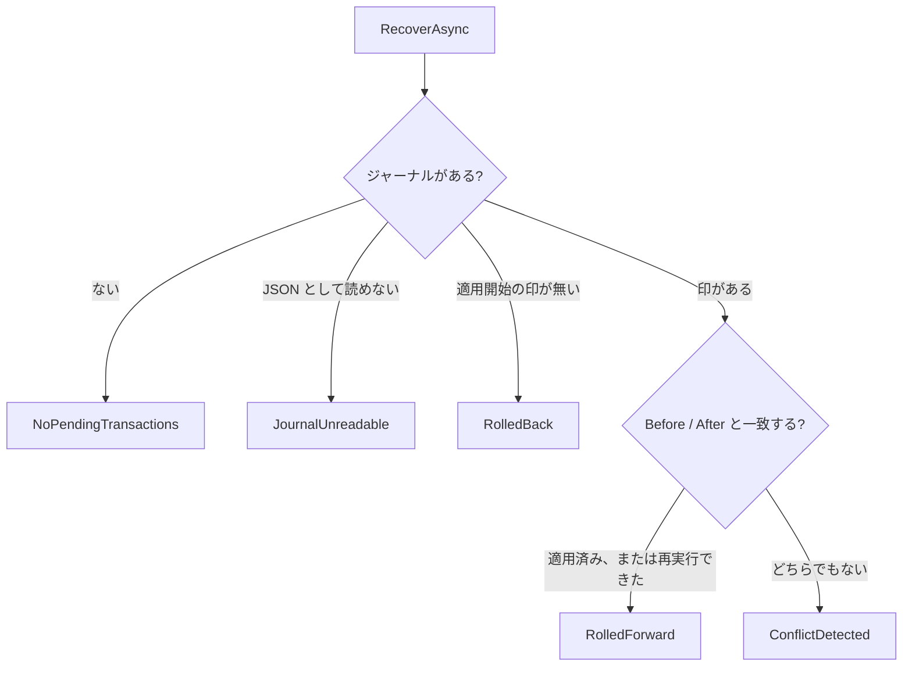

`ConflictDetected` は、落ちたあとにだれかがファイルを変えていて、戻すことも進めることも安全にできないときです。その操作は飛ばし、ほかの操作は進めて、`.txnew` とジャーナルを消します。飛ばした操作は、そのときの `Journals` に載ります。次の `RecoverAsync` はやり直しません。

`JournalUnreadable` は、ジャーナルが JSON として読めないときです。ジャーナルは残し、ファイル名から分かる `.txnew` だけ消します。`CreateDirectoryAsync` で作ったディレクトリは特定できないので残します。直すか消すまで、`BeginAsync` と `CommitAsync` は `RecoveryRequiredException` のままです。1 件でも読めなければ、ほかを処理したあともこの結果を返します。

落ちたジャーナルが残っているあいだ、新しいトランザクションは `BeginAsync` でも `CommitAsync` でも `RecoveryRequiredException` です。落ちたあとに配下へ確定したデータを、復旧が消さないようにするためです。`CommitAsync` で断られたときは本物に触れていません。破棄してから `RecoverAsync` を呼びます。

`RecoverAsync` は自動では走りません。開くたびに先に呼んでください。ディレクトリの全削除やディレクトリの移動のあと、残骸の `.txnew` が残っているかもしれないときも、先に呼びます。

## 同時に使う

このロックは、Txfio の利用者同士の協調です。素の `File` API やエクスプローラーは止めません。

同じトランザクションの公開メンバーは、重なって呼べません。先に入った呼び出しは最後まで行い、後から重なった呼び出しは状態を変える前に `InvalidOperationException` です。進行中の progress から同じインスタンスを呼ぶのも同じです。呼び出しが終わったあとは、また 1 つずつ呼べます。別のトランザクションは、別のパスなら今までどおり並行できます。

変更系は、対象のパスをロックする前にワークフォルダ全体もロックし、トランザクションが終わるまで共有で持ちます。別のパスを触るトランザクションは並行できます。パスの親ディレクトリ（ワークフォルダ自身は除く）には、共有の意図ロックを終わりまで取ります。ワークフォルダ全体を排他にするのは `RecoverAsync` だけで、ディレクトリの操作も共有のまま、別のパスを触るトランザクションと並行できます。配下を予約するのは、`DeleteTreeAsync`（そのディレクトリ）、ディレクトリの Move（元と先）、ディレクトリの `CopyAsync` とディレクトリの `ImportAsync`（先だけ）、`ExtractArchiveAsync` と `ImportArchiveAsync`（展開先）、ディレクトリの `DeleteAsync`（そのディレクトリ）です。予約は排他の意図ロックで、トランザクションが終わるまで残ります。配下をステージしようとすると `LockContentionException` で、`Path` はそのディレクトリです。`CreateDirectoryAsync` と `CreateArchiveAsync` は配下を予約しません。ディレクトリの `CopyAsync` のコピー元と、`CreateArchiveAsync` の入力ディレクトリは、呼び出しのあいだだけ排他の意図ロックで押さえ、呼び出しが終わると閉じます（読んでいるあいだに配下が変わらないようにするため）。`BeginAsync` か `RecoverAsync` に待ち時間を渡すと、その呼び出しの開始からその時間まで、共有違反のときだけ 100ms 間隔で開き直します。時間切れは同じ例外で、待ちの取り消しは `OperationCanceledException` です。`Path` には押さえられていたパスが 1 つ入り、ワークフォルダ全体を押さえているときはそのパスがワークフォルダです。プロセスが落ちると OS がロックのハンドルを閉じ、`.lock` ファイルは残します。`RecoverAsync` は処理のあいだワークフォルダ全体を排他で押さえます。変更中のトランザクションがあれば、待ち時間を渡さないときは何もせず `LockContentionException` です。`.lock` ファイルは消しません。

ワークフォルダの外は `ArgumentException`、`.txfio` 配下は `InvalidOperationException` です。`ReadAsync`、`ExistsAsync`、`ExportAsync`、`ExportArchiveAsync` はロックしません。ワークフォルダ自身を `CreateDirectoryAsync`、`DeleteAsync`、`DeleteTreeAsync` の対象にすると `ArgumentException` で、メッセージは「パスはワークフォルダの内側である必要があります」です。

## AddAsync

`AddAsync` は、ディスク上にまだ無いファイルの内容を、同じディレクトリの `.txnew` へ書きます。本物のパスはコミットまで存在せず、コミットするとそのパスへ rename します。破棄すると `.txnew` だけ消えます。印を書く前に落ちると `.txnew` を消し、印のあとでは After と一致すればスキップし、Before と一致すればやり直します。どちらでもなければ `ConflictDetected` です。ファイル Move の移動元なら、ディスク上にファイルがまだあっても Add できます。ディレクトリ Move の移動元への Add は失敗します。

ワークフォルダ全体は共有で押さえ、そのファイルもロックします。81920 バイト書くたびに `TransferProgress` を通知し、空の内容は最後に 1 回、0 バイトです。null の progress は通知しません。渡したストリームは閉じません。

```csharp
await using FileStream content = File.OpenRead(@"D:\incoming\big.bin");
await tx.AddAsync("big.bin", content);
```

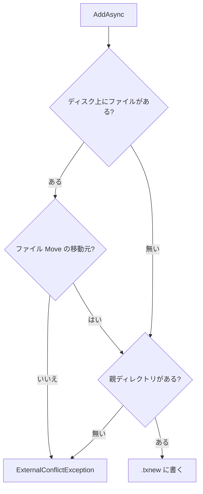

## UpdateAsync

`UpdateAsync` は、既にあるファイルの新しい内容を `.txnew` へ書きます。本物はコミットまで旧内容のままです。コミットすると本物を置換し、破棄すると `.txnew` だけ消えて本物は旧のまま残ります。印が無ければ `.txnew` を消し、印のあとでは After と一致すればスキップし、Before と一致すればやり直します。どちらでもなければ `ConflictDetected` です。

`BeginAsync` の `detectExternalChanges` を true にすると、ファイルの Update だけ、ステージした時点（またはその前に `ReadAsync` した時点）のサイズと最終更新日時（UTC）を覚えます。コミット前にその実ファイルがまだファイルで、どちらかが違えば `Failed` になり、本物は変えません。理由は `ExternalChange` です。既定の false は、中身だけ変わった Update を失敗にせず、Before をコミット時点のディスクにします。同じサイズで同じ最終更新日時の書き換えは見逃します。記録はメモリだけで、ジャーナルには書きません。`ReadAsync` は実ファイルを読むたびに記録を更新します。このトランザクションの `.txnew` を読んだときは更新しません。Read の記録があるパスは、もう一度ステージしても記録を更新しません。

ワークフォルダ全体は共有で押さえ、そのファイルもロックします。81920 バイトごとに通知します。

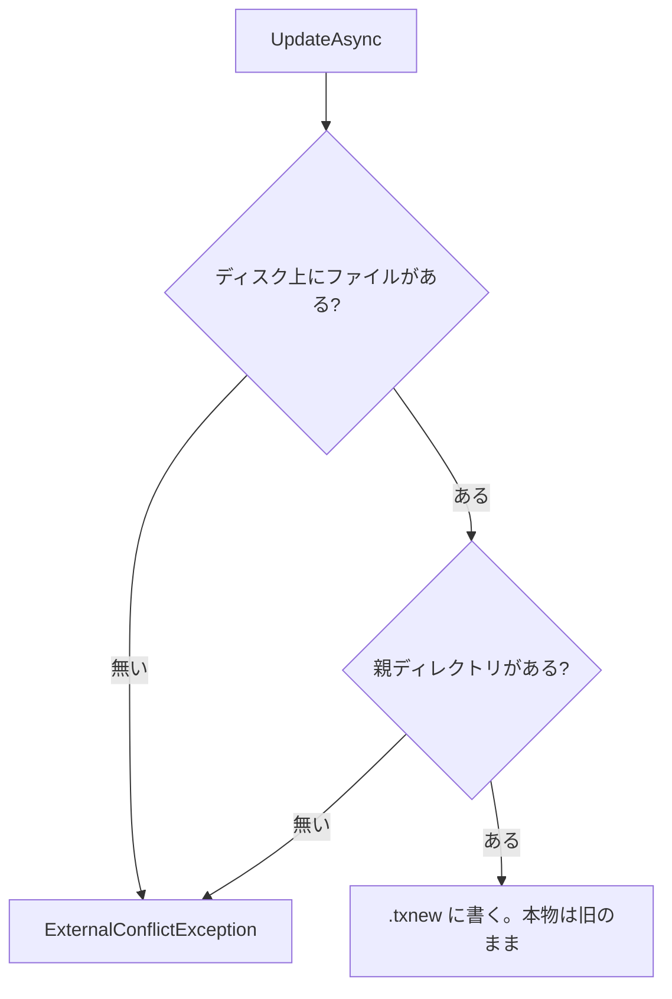

## 文字列と JSON

小さい文字列は `WriteAllTextAsync` です。コミット後の姿でファイルが無ければ Add、あれば Update です。ファイル `Move` の移動先は Update で、ファイルなら移動先の Add と元の Delete に畳みます。ファイル `Move` の移動元は Add です。ディレクトリ `Move` の移動先も移動元も失敗します。`Delete` のあとは、選ぶ時点では Add でも、記録は Update です。同じパスへ続けて書くと、予約は 1 件のまま内容だけ置き換わります。

```csharp
await tx.WriteAllTextAsync("new.txt", "hello");
await tx.WriteAllTextAsync("a.txt", "replaced");
await tx.WriteAllLinesAsync("lines.txt", new[] { "a", "b" });
```

`WriteAllLinesAsync` は各行のあとに `Environment.NewLine` を付けます。読み出した配列の要素に改行は含まれません。`contents` が null の `WriteAllLinesAsync` は `ArgumentNullException` です。`WriteAllTextAsync` の null は空のファイルとして書きます。エンコーディングを省略した書きは BOM なし UTF-8、読みは BOM があればそれを使います。

JSON も、書くときは同じ Add と Update です。オプションを省略すると `System.Text.Json` の既定なので、プロパティ名はそのままです。壊れた JSON は `JsonException` のままです。

```csharp
sealed record Note(string Title);

await tx.WriteAsJsonAsync("note.json", new Note("hello"));
Note? note = await tx.ReadFromJsonAsync<Note>("note.json");
```

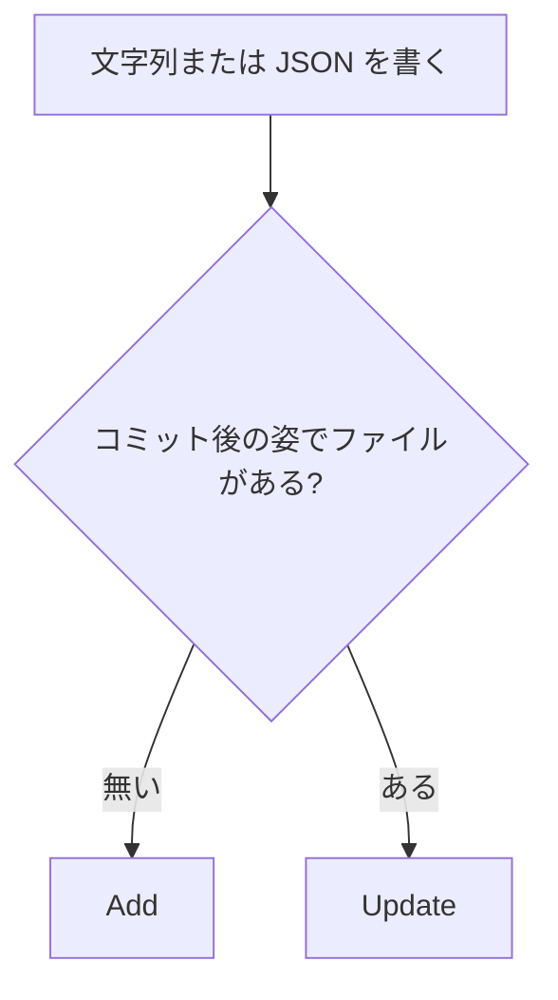

## ReadAsync

`ReadAsync` は、位置 0 の読み取りストリームを返します。破棄は呼び出し側です。このトランザクションの予約は、コミット後の姿で読みます。`Add` と `Update` は `.txnew`、ファイル `Move` の移動先は移動元のバイト、移動元と `Delete` の対象は無いです。`DeleteTree` の配下と、ディレクトリ `Move` の移動元の配下も無いです。移動先の配下は、移動元の対応するファイルです。ロックは取りません。ジャーナルにも残りません。

`ExistsAsync` は、同じ姿でファイルかディレクトリがあるかを bool で返します。無いパスは false で、ディレクトリだから失敗することはありません。

ストリームを閉じる前でも、コミットの rename は進みます。同じパスを、ストリームを開いたまま書き直すと失敗することがあります。`ReadAllTextAsync` と `ReadAllLinesAsync` は、この読み取りと同じバイトを文字列、または行の配列にします。

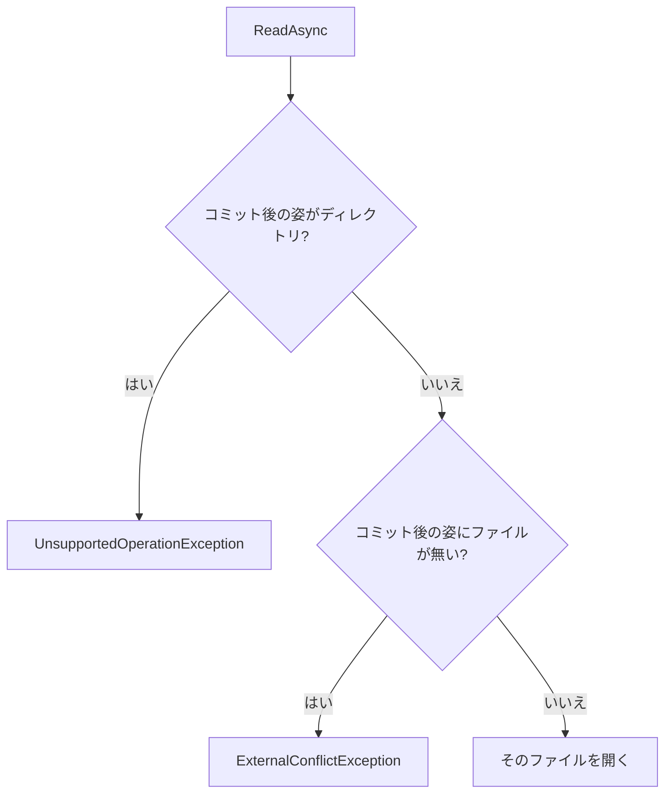

## DeleteAsync

`DeleteAsync` は削除を予約するだけで、ディスクが変わるのはコミットのときです。ファイルならそのファイルを消し、ディレクトリなら直下だけを消します。空のディレクトリは 1 回で予約できます。破棄しても、予約した対象は消えません。印が無ければディスクは変えず、印のあとでは残っていれば消し、消えていれば適用済み、ファイルにすり替わっていれば `ConflictDetected` です。

ファイルでは、ワークフォルダ全体を共有で押さえ、そのファイルをロックします。ディレクトリでは、ワークフォルダ全体を共有で押さえ、そのディレクトリをロックし、その意図ロックを排他で終わりまで持ちます。子のパスはロックしません。別のトランザクションが配下をステージすると `LockContentionException` で、`Path` はそのディレクトリです。直下に未予約の子があるときのメッセージは「ディレクトリの直下に未予約の子があります」です。次の木を直下だけで消すときは、深い方から予約します。

```text
tree/
  child/
    a.txt
```

```csharp
await tx.DeleteAsync("tree/child/a.txt");
await tx.DeleteAsync("tree/child");
await tx.DeleteAsync("tree");
```

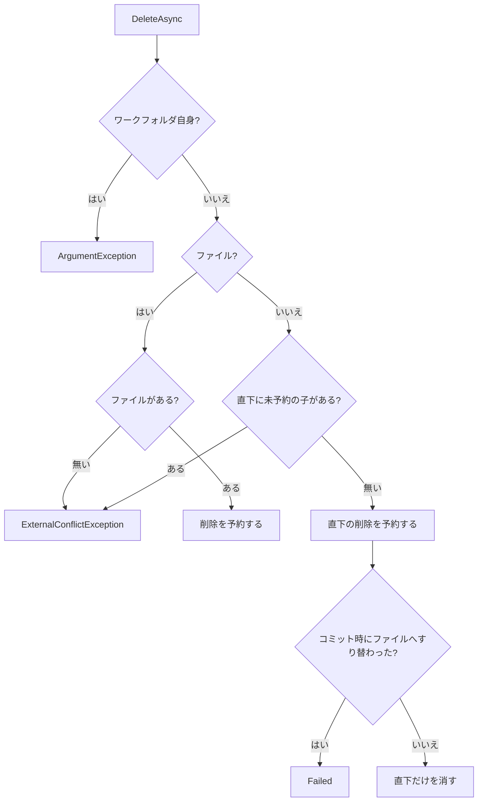

## DeleteTreeAsync

`DeleteTreeAsync` は、ディレクトリとその配下すべての削除を 1 件で予約します。ステージでは木を歩かず、コミット時に再帰削除します。破棄しても木は残ります。印が無ければディスクは変えず、印のあとではディレクトリが残っていれば消し、消えていれば適用済み、ファイルにすり替わっていれば `ConflictDetected` です。中の残骸も消すので、呼び側は先に `RecoverAsync` します。

ワークフォルダ全体は共有で押さえます。そのディレクトリの意図ロックは排他で終わりまで持ち、子のパスはロックしません。

```csharp
await tx.DeleteTreeAsync("tree");
```

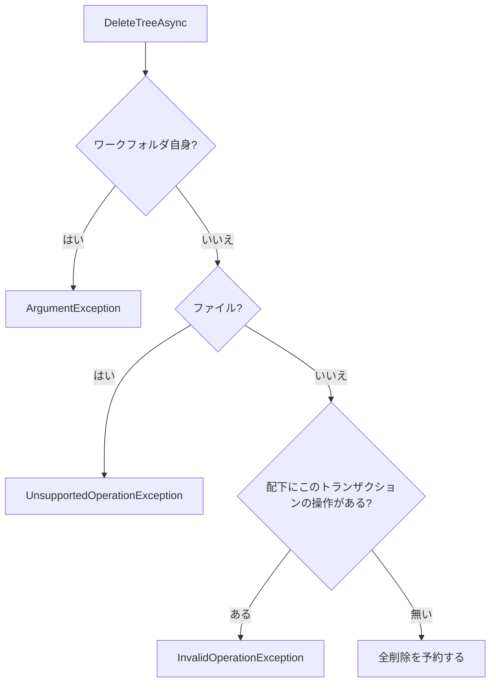

## MoveAsync

`MoveAsync` は、同一ボリューム内のファイルまたはディレクトリの移動を予約します。対象はコミットまで元の場所に残り、コミット時に 1 回 rename します。ディレクトリの中身はジャーナルに書かず、rename に付いていきます。破棄しても何も消えません。印が無ければディスクは変えず、印のあとでは After と一致すればスキップし、Before と一致すればやり直します。どちらでもなければ `ConflictDetected` です。

ファイルでは、ワークフォルダ全体を共有で押さえ、元と先をロックします。ディレクトリでも、ワークフォルダ全体は共有で押さえます。元と先をロックし、その意図ロックは排他で終わりまで持ちます。別ボリュームはコピーと削除には切り替えません。大文字小文字だけが違うパス、または完全に同じパスは `InvalidOperationException` です。そのときはジャーナルに載せず、ロックも取りません。移動先は、空いているか、既にこのトランザクションの別の Move の移動元であるときだけ受け付けます。呼び出しは空いている端からで、空いている端が無い循環は受け付けません。適用もその端からで、ファイルの移動元への Add はその Move のあとです。存在するファイルを上書きする Move は、`MoveAsync(oldPath, newPath, overwrite: true)` と明示したときだけです。コミットで 1 回の rename で置き換え、バイトはコピーしません（移動先の ACL は移動元のものになります）。移動先にこのトランザクションの Delete があれば、その Delete を置き換えの Move に畳みます。置き換えの Move の元と先へは、そのあと続けて操作できません。移動元か移動先がディレクトリで `overwrite: true` にすると、移動先の既存のファイルかディレクトリを入れ替えます。コミットでは、既存を `{名前}.{txid}.txold` へ退避してから rename し、`.txold` を消します。ファイルでディレクトリを入れ替えると、コミット後の姿ではその配下は無くなります。移動元は、同じトランザクションの `ImportAsync` や `CopyAsync` が作ったディレクトリでも構いません（`ImportAsync(外, "site.new")` のあと `MoveAsync("site.new", "site", overwrite: true)`）。移動先の `DeleteTreeAsync` は入れ替えに畳みます。同じパスの種類を変えるときは、新しい方を別の名前で用意してからこの入れ替えを使います。`Delete` のあとの `CreateDirectoryAsync` と、空ディレクトリの `Delete` のあとの Add は受け付けません。

```csharp
await tx.MoveAsync("tree", "archive");
```

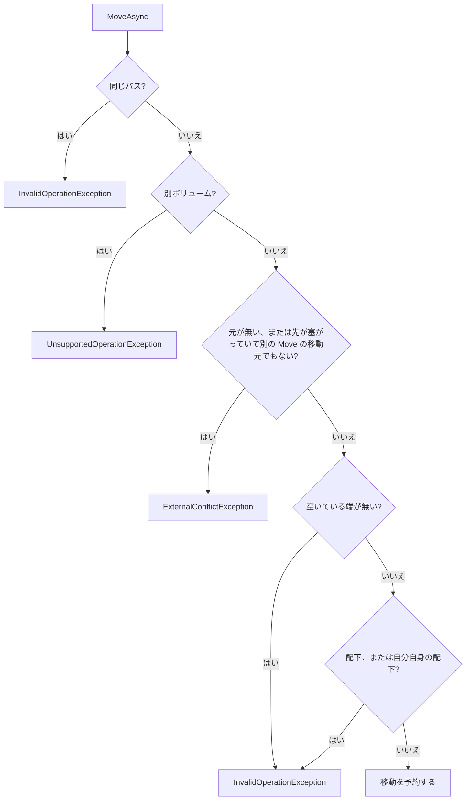

## CreateDirectoryAsync

`CreateDirectoryAsync` だけは、呼んだ時点で本物のパスに空ディレクトリを作ります。中身は素のファイル API で書きます。同じプロセスでも別プロセスでもよいです。配下では、親が最初からあるディレクトリと同じ操作ができます。ジャーナルの `CreateDirectory` はディレクトリ 1 件で、素のファイルは走査しません。`GetPendingChanges` には、配下で予約した操作が出ます。

コミットが `Succeeded` なら、ディレクトリはその場所に残り、rename はしません。破棄すると、中の `.txnew` と、素のファイル API で書いたものも、ディレクトリごと消えます。印が無ければ同じ削除をし、無ければ何もしません。印のあとでは、ディレクトリがあれば残して進め、無い、またはファイルなら `ConflictDetected` です。

ワークフォルダ全体は共有で押さえ、そのディレクトリをロックします。配下は予約しないので、別のトランザクションは子をステージできます。配下の操作は、それぞれの操作のロックも取ります。そのパス自身への Delete、DeleteTree、Move、Update、もう一度の `CreateDirectoryAsync` は畳みません。配下にこのトランザクションの操作が無いときだけ、そのディレクトリをコピー元にできます。

```csharp
await using ITransaction tx = await Txfio.BeginAsync(@"D:\share\work");
await tx.CreateDirectoryAsync("drop");
await File.WriteAllTextAsync(@"D:\share\work\drop\a.txt", "from-api");
await tx.WriteAllTextAsync(@"drop\b.txt", "from-txfio");
CommitReport report = await tx.CommitAsync();
```

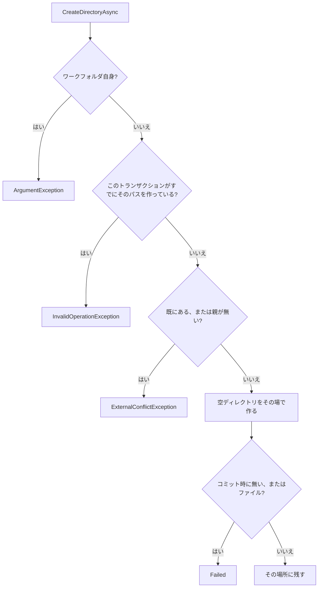

## CopyAsync

`CopyAsync` は、ワークフォルダの中のファイルまたはディレクトリを、ワークフォルダの中へコピーします。コピー元は残します。同じボリュームでもバイトをコピーし、rename やハードリンクにはしません。ファイルは先の `.txnew` を Add として残し、ディレクトリはディスク上のファイルを 1 つずつ Add にし、空のサブディレクトリも作ります。未コミットの Add は本物の名前でディスクに無いので含まれません。ジャンクションとシンボリックリンクは辿りません。

コミットすると先が残り、元も残ります。失敗、取り消し、未コミットの破棄では、作りかけの `.txnew` と、この操作が作ったディレクトリを消します。名指ししたパスがリパースポイントなら `InvalidOperationException` で、メッセージは「リパースポイントは操作できません」です。ファイルでは、ワークフォルダ全体を共有で押さえ、元と先をロックします。ディレクトリでも、ワークフォルダ全体は共有で押さえます。元と先をロックし、子はロックしません。先の意図ロックは排他で終わりまで持ちます。元の意図ロックは呼び出しのあいだだけ排他で持ち、終わると閉じます。81920 バイトごとに通知します。ディレクトリは全体サイズを測らないので、`TotalBytes` は null です。

```csharp
await tx.CopyAsync("src", "dest");
```

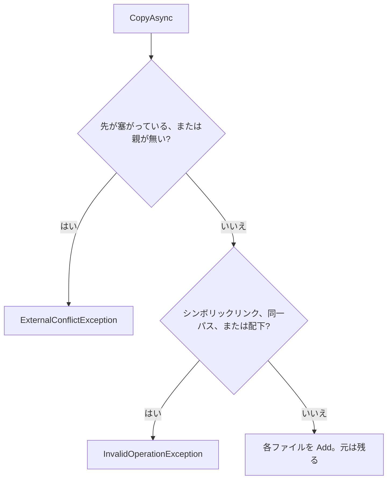

## ImportAsync

`ImportAsync` は、ワークフォルダの外にあるファイルまたはディレクトリを、中の `.txnew` へコピーして Add として残します。コピー元は消しません。先のディレクトリ自身とその空のサブディレクトリは、この操作が作ります。失敗、取り消し、破棄では、作りかけの `.txnew` と、この操作が作ったディレクトリを消します。

ジャンクションとシンボリックリンクは辿りません。ファイルでは、ワークフォルダ全体を共有で押さえ、先だけをロックします。ディレクトリでも、ワークフォルダ全体は共有で押さえます。先だけをロックし、その意図ロックは排他で終わりまで持ちます。81920 バイトごとに通知します。ディレクトリの `TotalBytes` は null です。

```csharp
await tx.ImportAsync(@"D:\incoming\drop", "imported");
```

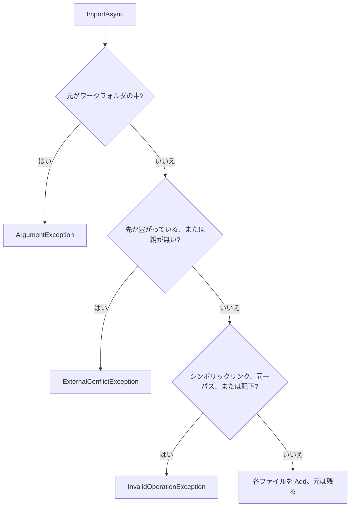

## ExportAsync

`ExportAsync` は、読み取りと同じバイトをワークフォルダの外へコピーします。ファイルは 1 つ、ディレクトリは配下の各ファイルです。ジャーナルには残さず、ワークフォルダのファイルは変えず、ロックもしません。未コミットの Add は含まれません。Update 済みのファイルを出すと、出るのは `.txnew` の新しい内容で、ディスク上の本物は古いままです。

ジャンクションとシンボリックリンクは辿りません。成功したコピー先は、破棄しても残ります。失敗や取り消しでは、外に作りかけたものを消します。コミットは外を変えません。復旧の対象でもありません。81920 バイトごとに通知します。ディレクトリの `TotalBytes` は null です。

```csharp
await tx.ExportAsync("src", @"D:\outgoing\copy");
```

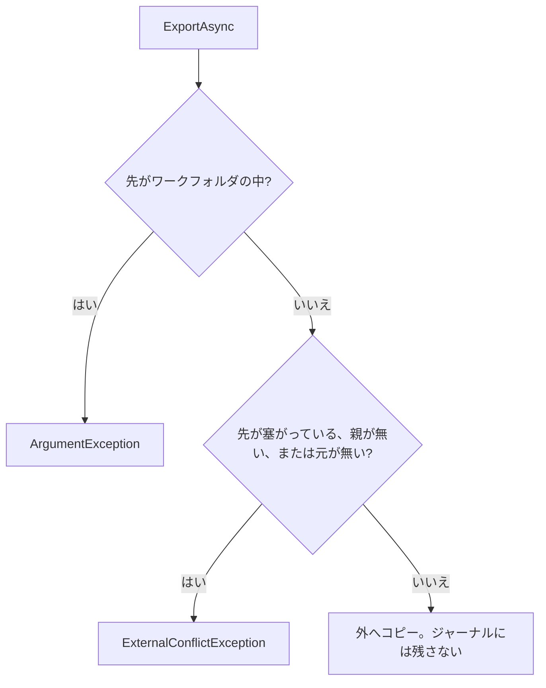

## ZIP アーカイブ

ZIP は `System.IO.Compression` で読み書きし、ほかの操作と同じトランザクションに入ります。ワークフォルダの中と外の区別は、Copy / Import / Export と同じです。反対側のパスを渡すと `ArgumentException` です。ZIP のパスや展開先が既にある、または親が無いときは `ExternalConflictException` で、上書きも混ぜ込みもしません。

| API                   | 読むもの                                          | 書くもの                                 | ロック                                                                  |
| --------------------- | ------------------------------------------------- | ---------------------------------------- | ----------------------------------------------------------------------- |
| `CreateArchiveAsync`  | ディスク上のファイル。`CopyAsync` と同じ          | 中の ZIP を 1 件の Add                   | ワークフォルダ全体は共有。元と ZIP も。入力ディレクトリは呼び出しのあいだだけ排他の意図ロック。配下は予約しない |
| `ExportArchiveAsync`  | 読み取りと同じバイト。Update の内容が入る         | 外の ZIP。成功した ZIP は破棄しても残る  | しない                                                                                                                    |
| `ExtractArchiveAsync` | 中の ZIP を読み取りと同じバイトで。未コミットも可 | 新しいディレクトリへ、ファイルごとの Add | ワークフォルダ全体は共有。展開先をロックし、その意図ロックは終わりまで排他                 |
| `ImportArchiveAsync`  | 外の ZIP                                          | 同上                                     | 同上                                                                                                                      |

作成では、`CompressionLevel`（省略時は `Optimal`）と、ディレクトリ名をエントリのルートに含めるか（省略時は含めない）を選べます。空のサブディレクトリはディレクトリエントリになり、エントリの日時は元のファイルの最終更新日時です。エントリ名は UTF-8 で書きます。進捗は圧縮前のバイト数で、`TotalBytes` は null です。

入れるものと名前を選ぶときは、`ArchiveEntrySource` の列を渡します。Create と Export の両方で使えます。名前を省略するとワークフォルダからの相対パスになり、ディレクトリに空文字を渡すと中身を ZIP のルートに置きます。ディレクトリは配下を再帰で入れます。ZIP の中はリストの順です。同じファイルを別の名前で 2 回入れても構いません。空のリストなら空の ZIP です。名前は展開と同じ規則（下の段落）で確かめ、当たれば `ArgumentException` です。ワークフォルダ全体は共有のままで、ディレクトリの要素は呼び出しのあいだだけ排他の意図ロックで押さえます。入力の配下は予約しません。

```csharp
await tx.ExportArchiveAsync(
    new[]
    {
        new ArchiveEntrySource(@"reports\2026-09.csv", "monthly/09.csv"),
        new ArchiveEntrySource("assets", ""),
    },
    @"D:\outgoing\bundle.zip");
```

`ExportArchiveAsync` は `ExportAsync` と同じく、ディレクトリでは未コミットの Add を含みません。ファイルを直接渡せば、Add した内容も入ります。

展開では、展開したファイルの最終更新日時をエントリの日時にします。UTF-8 の印が無い古い ZIP（Windows で作った Shift_JIS 名など）は、`entryNameEncoding` で読み方を指定します。進捗は展開後のバイト数で、`TotalBytes` はエントリの合計サイズです。

失敗、取り消し、破棄では、作りかけの `.txnew`（Export なら外の ZIP）と、この操作が作ったディレクトリを消します。

```csharp
await tx.ExportArchiveAsync("reports", @"D:\outgoing\reports.zip");
Encoding.RegisterProvider(CodePagesEncodingProvider.Instance);
await tx.ImportArchiveAsync(@"D:\incoming\drop.zip", "incoming", Encoding.GetEncoding(932), maxExtractedBytes: 1L << 30);
```

展開は、書き始める前にエントリ名を全部確かめます。1 つでも次に当たれば、何もステージせず、展開先も作らずに `InvalidDataException` です。展開先の外へ出る名前（`..`、先頭の `/`、ドライブ指定）、Windows のパスに使えない名前（`<>:"|?*`、末尾の `.` や空白、`CON` や `NUL` などの予約名）、`.txnew` で終わる名前、大文字と小文字だけが違う重複、同じ名前のファイルとディレクトリです。ZIP 自体が壊れているときも `InvalidDataException` です。

`maxExtractedBytes` を渡すと、エントリが申告した展開後のサイズの合計が上限を超える ZIP は、何もステージせずに `InvalidDataException` になります。無圧縮のエントリは申告より多く読めるので、実際に読んだバイト数が上限を超えたときも同じ例外になり、書きかけは消します。圧縮率の高い ZIP で共有のディスクを埋めないよう、外から受け取った ZIP では上限を渡してください。省略すると上限はありません。

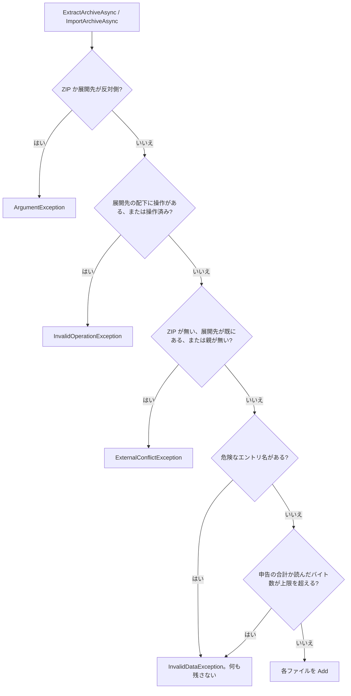

## 同じパスへ続けて呼ぶ

同じパスへ続けて呼ぶと、予約は次のように 1 件へ畳みます。図に無い組み合わせは `InvalidOperationException` で、メッセージは「このパスは既に別の操作でステージングされています」です。`DeleteTreeAsync` の配下への操作、ディレクトリ Move の移動元と移動先の配下への操作も、同じ例外です。`CreateDirectory` の配下は、この図の各枝に従います。

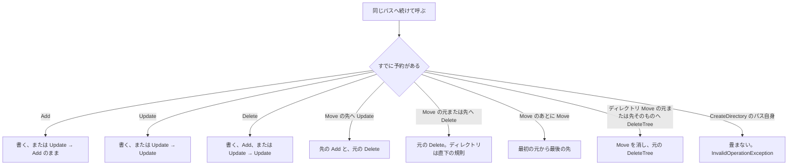

## 例外の見分け

コミットの成否は例外にしません。`CommitReport.Result` を見てください。拒んだ操作と飛ばした操作は `Operations` に載ります。それ以外の失敗は例外です。基底は `TxfioException` です。

| 状況                                                                                  | 型                              |
| ------------------------------------------------------------------------------------- | ------------------------------- |
| 対象が無い、既にある、親が無い、直下に予定外の子がある、コピー先が塞がっている        | `ExternalConflictException`     |
| ディレクトリの読み取り、ファイルへの `DeleteTreeAsync`、ボリュームをまたぐ Move       | `UnsupportedOperationException` |
| 別操作でステージング済み、自分自身の配下への Move や Copy、内側のリパースポイント | `InvalidOperationException`     |
| パスがワークフォルダの外、Import の元が中、Export の先が中                            | `ArgumentException`             |
| ほかの Txfio がパスまたはワークフォルダを押さえている                                 | `LockContentionException`       |
| 落ちたジャーナルが残っている（先に `RecoverAsync`）                                   | `RecoveryRequiredException`     |
| JSON として読めない                                                                   | `JsonException`                 |
| ZIP のエントリ名が危険、または ZIP が壊れている                                       | `InvalidDataException`          |

`ExternalConflictException` と `LockContentionException` は、失敗したパスを 1 つ持ちます。`RecoveryRequiredException` の `Path` はワークフォルダです。

## TxFileManager と SQLite

- **Txfio**（このライブラリ）
- **[TxFileManager](https://github.com/chinhdo/txFileManager)**（NuGet `TxFileManager`）。`System.Transactions` にファイル操作を参加させるライブラリです。Windows の TxF ではありません。TxF は Microsoft が非推奨としており、このライブラリは採用していません
- **データを SQLite に置く使い方**。ファイルツリーの代わりに、行や BLOB を 1 つのデータベースファイルへ入れます

### 有利なとき

本物のファイルを、遅いファイルサーバー上に残したいときです。コミットは再コピーではなく rename で、ディレクトリの移動は子を走査しません。ジャーナルはワークフォルダに残るので、プロセスが落ちても `RecoverAsync` で片付けられます。大きなディレクトリの移動や `DeleteTreeAsync` で、一時フォルダへの退避コピーを避けられます。

### 不利なとき

SQL の INSERT とファイル作成を、落ちても両方戻る 1 つのトランザクションにしたいときです。それは TxFileManager と `TransactionScope` の領域で、このライブラリは参加しません。ただし TxFileManager 側には、落ちたあとのファイル復旧がありません。

確定後も普通のファイルである必要がなく、検索や同時読み取りの一貫性が欲しいときは、SQLite の方が単純です。共有フォルダ上の既存ツールがファイルを直接開く必要があるなら、SQLite へ入れると利用者がファイルを扱えなくなります。

コミットの途中で他プロセスから見て中間状態が許されないときも向きません。複数ファイルの反映は 1 操作ずつです。`.txnew` が見えること、素のファイル API がロックを無視することも、許容できないなら向きません。

| 観点                      | Txfio                                                                                                                                 | TxFileManager                                                                    | SQLite にデータを置く                                             |
| ------------------------- | ------------------------------------------------------------------------------------------------------------------------------------- | -------------------------------------------------------------------------------- | ----------------------------------------------------------------- |
| 確定後に残るもの          | 普通のファイルとディレクトリ                                                                                                          | 普通のファイルとディレクトリ                                                     | データベースファイル。個別ファイルにはならない                    |
| いつ見えるか              | コミットまで本物のパスは旧状態。`.txnew` は見える                                                                                     | 呼んだ瞬間に反映される。分離は Read Uncommitted                                  | 他接続からは、コミット済みの状態が見える                          |
| クラッシュ                | ジャーナルが残る。`RecoverAsync` が戻すか進める                                                                                       | 復旧は揮発。落ちると途中のファイル操作が残る                                     | DB はジャーナルまたは WAL で復旧する。DB の外のファイルは含まない |
| 複数対象の揃い            | コミット中は一部だけ新しい。`Failed` は本物を変えない                                                                                 | 変更は即時に見える。複数ファイルの Move のロールバックが途中で止まった報告がある | DB 内の変更は 1 つのコミットに揃う                                |
| ディレクトリ全削除        | `DeleteTreeAsync`。ステージでは走査せず、コミット時に再帰削除。`DeleteAsync` は直下だけ                                               | `DeleteDirectory`。実行時点で temp へ退避する                                    | パスを表す行を SQL で消す。ファイルツリーの削除ではない           |
| ディレクトリの移動        | 同一ボリュームで 1 回の rename。ボリューム跨ぎはエラー                                                                                | `MoveDirectory`。即時。temp が別ボリュームだとコピーと削除になる                 | パス列の更新                                                      |
| 一時置き場                | 使わない。`.txnew` は同じディレクトリ                                                                                                 | 既定は `Path.GetTempPath()`                                                      | データベースファイル自身                                          |
| SMB 上の共有              | 対象。サーバーキャッシュの永続化は保証外                                                                                              | 設計の主対象ではない                                                             | ネットワーク共有に置く使い方はサポート外                          |
| DB と同じトランザクション | 参加しない                                                                                                                            | `TransactionScope` で参加できる                                                  | データベースの中だけ                                              |
| 同時実行                  | 利用者間はパス単位。ディレクトリの配下は意図ロックで予約する（`CreateDirectoryAsync` と ZIP の作成は予約しない）。ワークフォルダ全体を排他にするのは `RecoverAsync` だけ | スレッドセーフと README にある。分離は Read Uncommitted                          | 書き込みは原則 1 接続。読み取りは WAL などで並行できる            |
| 素の File API             | 止められない                                                                                                                          | 止められない                                                                     | DB を経由しない読み書きはトランザクションの外                     |
| プラットフォーム          | 保証は Windows                                                                                                                        | .NET Standard 2.0。Windows と Ubuntu でテストされている                          | クロスプラットフォーム                                            |
| API の形                  | 非同期のみ。コピーの進捗あり                                                                                                          | 同期が中心                                                                       | `Microsoft.Data.Sqlite` なら同期と非同期                          |

TxFileManager の機能一覧は、公開 README と `DeleteDirectoryOperation`（ディレクトリを temp へ移し、ロールバックで戻し、確定後に temp を再帰削除する）に基づきます。作者は揮発エンリストだけをサポートし、プロセスが落ちると途中のまま残ると説明しています。SQLite をネットワークファイルシステム上に置くことは、SQLite 作者が確実な動作の対象外としています。

## ドキュメント

| 文書                                         | 役割                 |
| -------------------------------------------- | -------------------- |
| [`docs/design.md`](docs/design.md)           | 設計の正本           |
| [`docs/roadmap.md`](docs/roadmap.md)         | 実装順（Phase は仮） |
| [`docs/conventions.md`](docs/conventions.md) | コーディング規約     |
| [`CONTRIBUTING.md`](CONTRIBUTING.md)         | 進め方               |
| [`SECURITY.md`](SECURITY.md)                 | 脆弱性の報告         |

## ローカル検証

Windows では `./build.ps1` がゲートです。Linux ではこのスクリプトを実行せず、restore / format / build / `dotnet test` を回します。Linux では Windows 専用のテストが Skip になります。

```powershell
./build.ps1
```

## ライセンス

[MIT](LICENSE)
