# Txfio

English | [日本語](README.ja.md)

A file IO library for Windows shared folders (NTFS / SMB) that leaves the real files unchanged until you commit, and can recover after a crash.

It is not on nuget.org yet. Reference this repository and build it. The TFM is `net8.0`. When the SMB server's own cache reaches the disk is not guaranteed.

The source of truth for the contract is [`docs/design.md`](docs/design.md). How to use it is in this README.

## Getting started

The work folder is an existing directory. When the application opens the folder, it calls `RecoverAsync` first.

```csharp
using Txfio;

await Txfio.RecoverAsync(@"D:\share\work");

await using ITransaction tx = await Txfio.BeginAsync(@"D:\share\work");
await tx.WriteAllTextAsync("a.txt", "hello");
CommitReport report = await tx.CommitAsync();
```

Until you call `CommitAsync`, the new content is kept in a `.txnew` file in the same directory. The real path does not change. The commit is a rename. If you dispose without calling `CommitAsync`, the `.txnew` and the journal are deleted.

`CommitReport.Result` is not an exception. On success, `Operations` is empty. `Failed` lists the operations rejected by the check, and `PartialConflict` lists the operations skipped during apply, with paths and reasons.

| Value             | Meaning                                                              |
| ----------------- | -------------------------------------------------------------------- |
| `Succeeded`       | Applied as planned                                                   |
| `PartialConflict` | External interference during apply. The commit still went through    |
| `Failed`          | The check before apply failed. The real paths have not changed yet   |

The next `RecoverAsync` rolls a crashed journal back or forward. `RecoverReport.Result` is `NoPendingTransactions` / `RolledBack` / `RolledForward` / `ConflictDetected` / `JournalUnreadable`. The journals it processed are in `Journals`, in lexical order of the path ignoring case. For `ConflictDetected`, the skipped operations are listed there too. Journals of transactions that are still alive, in another process or in this one, are not touched and are not in `Journals`. While a crashed journal remains, `BeginAsync` and `CommitAsync` throw `RecoveryRequiredException`. A journal that cannot be read as JSON is not deleted, so the same exception stays until you fix or delete it.

## What it cannot do

- `ReadAsync` of a directory. It throws `UnsupportedOperationException`
- Archives other than ZIP (tar, bare GZip, and so on). Creating and extracting a ZIP never overwrites an existing file or extracts into an existing directory
- `MoveAsync` across volumes. It does not switch to copy and delete. For files, use `ImportAsync` and `ExportAsync` explicitly
- Several files becoming consistent at one instant as seen from outside. During a commit, some files may already be new while others are still old
- Cancelling after the commit has started. Once apply starts it runs to the end, and anything interrupted is for `RecoverAsync`
- Joining the same transaction as SQL or DTC
- Preventing changes from the plain file API or Explorer. The `.txnew` files are visible before commit too
- Guaranteed behavior on Linux

## Operations

Only the operations you call are tracked. There is no diff scan of the whole folder. There are no synchronous versions.

| API                                          | What it does                                                                                                                   |
| -------------------------------------------- | ------------------------------------------------------------------------------------------------------------------------------ |
| `AddAsync` / `UpdateAsync`                   | Create or replace a file. The content is written to `.txnew`. Progress is `TransferProgress`                                   |
| `DeleteAsync`                                | Schedule deleting a file, or a directory by its direct children only. The actual delete happens at commit                     |
| `DeleteTreeAsync`                            | Schedule deleting a directory and everything under it. Staging does not walk the tree; the recursive delete happens at commit |
| `MoveAsync`                                  | Schedule moving a file or directory within one volume. A directory is renamed once at commit, and its contents go with it      |
| `CreateDirectoryAsync`                       | Create an empty directory when called. Normal operations work under it. Discard deletes the directory with its contents        |
| `CopyAsync`                                  | Copy a file or directory inside the work folder. The source stays. A directory becomes an Add per file plus empty directories  |
| `ImportAsync`                                | Copy a file or directory from outside the work folder into `.txnew` and keep it as an Add. The source is not deleted          |
| `ExportAsync`                                | Copy the same bytes as a read to outside the work folder. A directory copies each file under it. No journal, no locks          |
| `CreateArchiveAsync`                         | Create a ZIP from a file or directory inside the work folder, or from a list of source and name pairs, and keep it as an Add   |
| `ExportArchiveAsync`                         | Create a ZIP outside the work folder with the same bytes as a read. No journal, no locks                                       |
| `ExtractArchiveAsync`                        | Extract a ZIP inside the work folder into a new directory, and keep each file as an Add                                        |
| `ImportArchiveAsync`                         | Extract a ZIP outside the work folder into a new directory, and keep each file as an Add. The ZIP is not deleted               |
| `ReadAsync`                                  | Open the file in the post-commit view. No locks                                                                                |
| `ExistsAsync`                                | Return whether a file or directory exists in the post-commit view. No locks                                                    |
| `GetEntriesAsync`                            | Return the files and directories directly under a directory in the post-commit view (not recursive). No locks                 |
| `ReadAllTextAsync` / `ReadAllLinesAsync`     | Turn the same bytes as a read into a string or an array of lines                                                               |
| `WriteAllTextAsync` / `WriteAllLinesAsync`   | Add if the post-commit view has no file, Update if it has one. Without an encoding, UTF-8 without a BOM                        |
| `AppendAllTextAsync` / `AppendAllLinesAsync` | Append to the end in the post-commit view (Add if missing, otherwise an Update with the appended content; reads the existing content into memory) |
| `ReadFromJsonAsync` / `WriteAsJsonAsync`     | `System.Text.Json`. Writes are Add / Update as above. Without options, the default settings                                    |
| `GetPendingChanges`                          | The list of operations not committed yet                                                                                       |
| `CommitAsync`                                | Check, then apply the renames and deletes. The result is `CommitReport`                                                        |
| `RecoverAsync`                               | Roll a crashed journal back or forward, depending on the marker. The result is `RecoverReport`                                |

Parent directories are not created automatically. Only `CopyAsync` and directory `ImportAsync` / `ExportAsync` create the destination directory itself and its empty subdirectories. `ExtractArchiveAsync` / `ImportArchiveAsync` also create the destination directory itself and the directories in the entries. `CreateDirectoryAsync` creates only the target empty directory, not its parent. The metadata folder `.txfio` and everything under it cannot be used.

## How a transaction flows

A transaction has four stages: recover, begin, schedule, and end. It ends with a commit, a discard, or a process crash.

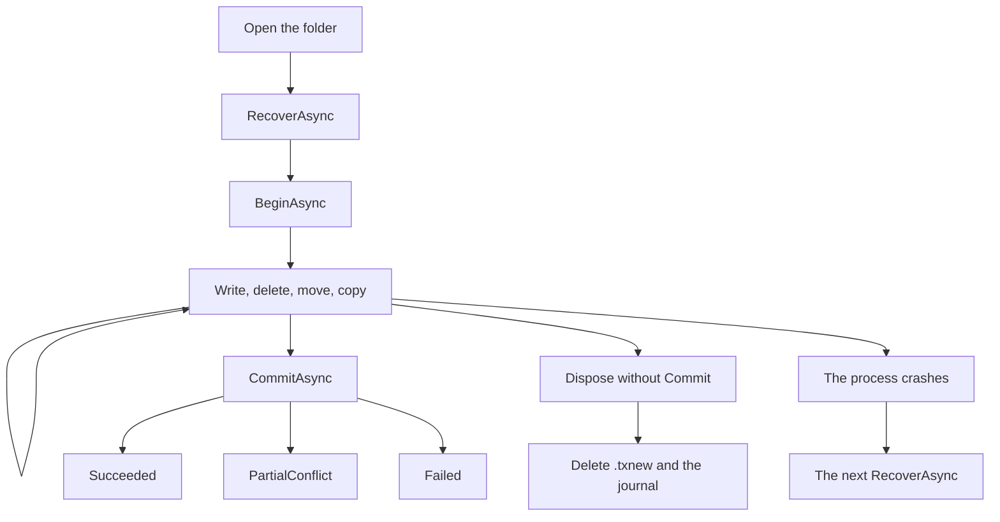
```mermaid
flowchart TD
  open["Open the folder"] --> recover["RecoverAsync"]
  recover --> begin["BeginAsync"]
  begin --> stage["Write, delete, move, copy"]
  stage --> stage
  stage --> commit["CommitAsync"]
  stage --> dispose["Dispose without Commit"]
  stage --> crash["The process crashes"]
  commit --> succeeded["Succeeded"]
  commit --> partial["PartialConflict"]
  commit --> failed["Failed"]
  dispose --> rolled["Delete .txnew and the journal"]
  crash --> next["The next RecoverAsync"]
```

While `a.txt` is being replaced from `old` to `new`, the disk looks like this. `{guid}` is the transaction ID.

```text
D:\share\work\
  a.txt                          the real file, still old
  a.txt.{guid}.txnew             the new content
  .txfio\
    tx-{guid}.journal            the scheduled operations
    locks\                       cooperative locks between Txfio users
```

Explorer shows the `.txnew`. `File.ReadAllText` reads the real `old`. `ReadAllTextAsync` in the same transaction reads `new`.

```csharp
await using ITransaction tx = await Txfio.BeginAsync(@"D:\share\work");
await tx.WriteAllTextAsync("a.txt", "new");
string staged = await tx.ReadAllTextAsync("a.txt"); // "new"
```

`GetPendingChanges` is the list of operations not committed yet. A directory copy appears as an Add per file. Operations scheduled under a `CreateDirectoryAsync` directory appear. Files written with the plain file API do not.

### When you commit

`CommitAsync` checks every precondition first. If this fails, the result is `Failed`, and the real files have not changed yet.

After the check, it writes an "apply started" marker to the journal, then changes the real files. Once apply starts, it ignores the `CancellationToken` and runs to the end. Any interruption from here on is the job of `RecoverAsync` after the crash.

The apply order is not the order of your calls.

1. Add, Move, CreateDirectory
2. Update
3. Delete and DeleteTree. Delete goes from the deepest path

When everything is done, the journal is deleted. The `.txnew` files have been renamed to the real names, so none remain.

If another process changed a file during apply, or a file could not be opened, the result is `PartialConflict`. The return value is not an exception, and the commit went through. The `.txnew` of operations that were not applied, and the journal, are deleted. The skipped operations are in `Operations`. The reasons are: matches neither Before nor After, the target is missing, the destination already exists, it was swapped for a file or directory, a sharing violation, or another IO failure. Sharing violations are not retried automatically. The same instance cannot retry. Handle it differently from `Succeeded`.

When the check fails, the result is `Failed`. The rejected operations are in `Operations`. The reasons are: the target is missing, it already exists, it was swapped for a file or directory, the direct-children conditions of a directory are not met, or the target of an Update or a file Delete is read-only (`ReadOnly`). When `detectExternalChanges` is true, a recorded file whose size or last write time differs is included too. The real paths have not changed yet. After fixing the state, you can call `CommitAsync` again on the same transaction.

### When you discard without committing

When you leave `await using` or call `DisposeAsync` before the marker is written, the uncommitted `.txnew` files, the directories a copy created, the `CreateDirectoryAsync` directories, and the journal are deleted. Whatever was written with the plain file API inside a `CreateDirectoryAsync` directory is deleted together with that directory. Other files this transaction did not touch stay.

Cancelling before the commit starts does the same cleanup on discard. If apply throws after the marker is written, discard does not delete them; it only closes the locks. The exception reaches you as is. The journal and `.txnew` files stay, and the next `RecoverAsync` rolls forward.

### When the process crashes

A journal that crashed before the marker was written is rolled back by the next `RecoverAsync`. Besides the `.txnew` files, it deletes the directories that copy, Import, and extract created. A journal that crashed after the marker is rolled forward, and the created directories stay. The library decides. The application calls `RecoverAsync` once when it opens the folder.

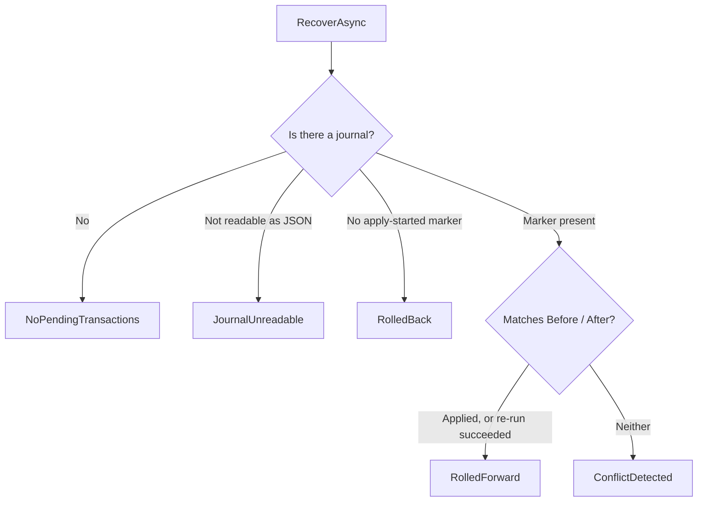
```mermaid
flowchart TD
  call["RecoverAsync"] --> has{"Is there a journal?"}
  has -->|No| none["NoPendingTransactions"]
  has -->|Not readable as JSON| unreadable["JournalUnreadable"]
  has -->|No apply-started marker| back["RolledBack"]
  has -->|Marker present| match{"Matches Before / After?"}
  match -->|Applied, or re-run succeeded| forward["RolledForward"]
  match -->|Neither| conflict["ConflictDetected"]
```

`ConflictDetected` means someone changed a file after the crash, and it can be neither rolled back nor forward safely. That operation is skipped, the others go forward, and the `.txnew` files and journal are deleted. The skipped operations are in `Journals` of that call. The next `RecoverAsync` does not retry.

`JournalUnreadable` means the journal cannot be read as JSON. The journal stays, and only the `.txnew` files identified by the file name are deleted. Directories made with `CreateDirectoryAsync` cannot be identified, so they stay. Until you fix or delete it, `BeginAsync` and `CommitAsync` stay `RecoveryRequiredException`. If even one journal is unreadable, this result is returned even after the others are processed.

While a crashed journal remains, a new transaction gets `RecoveryRequiredException` from both `BeginAsync` and `CommitAsync`. This keeps recovery from deleting data committed under a directory after the crash. When `CommitAsync` refuses, it has not touched the real files. Dispose the transaction, then call `RecoverAsync`.

`RecoverAsync` does not run automatically. Call it first every time you open the folder. Also call it first when leftover `.txnew` files may remain after deleting a whole directory or moving a directory.

## Concurrent use

These locks are cooperation among Txfio users. They do not stop the plain `File` API or Explorer.

The public members of one transaction cannot be called concurrently. The call that entered first runs to the end, and a later overlapping call throws `InvalidOperationException` before it changes any state. Calling the same instance from a progress callback in progress is the same. After a call finishes, calls can be made one at a time again. Other transactions can run in parallel on other paths, as before.

Write operations also lock the whole work folder before locking the target path, and hold it as shared until the transaction ends. Transactions that touch other paths can run in parallel. The parent directories of a path (except the work folder itself) get shared intent locks until the end. Only `RecoverAsync` makes the work-folder lock exclusive; directory operations keep it shared too and can run in parallel with transactions that touch other paths. The operations that reserve what is under a directory are `DeleteTreeAsync` (that directory), directory Move (source and destination), directory `CopyAsync` and directory `ImportAsync` (destination only), `ExtractArchiveAsync` and `ImportArchiveAsync` (destination), and directory `DeleteAsync` (that directory). The reservation is an exclusive intent lock that remains until the transaction ends. Trying to stage under it throws `LockContentionException`, with `Path` set to that directory. `CreateDirectoryAsync` and `CreateArchiveAsync` do not reserve what is under them. The source of a directory `CopyAsync` and the input directory of `CreateArchiveAsync` are held with an exclusive intent lock only during the call, and closed when the call ends (so that nothing under them changes while they are read). If you pass a wait time to `BeginAsync` or `RecoverAsync`, it retries every 100 ms, only on sharing violations, until that time has passed since the start of the call. Timing out is the same exception, and cancelling the wait is `OperationCanceledException`. `Path` holds one path that was held; when the whole work folder was held, that path is the work folder. When a process crashes, the OS closes the lock handles, and the `.lock` files stay. `RecoverAsync` holds the whole work folder exclusively while it works. If a transaction is changing things, it does nothing and throws `LockContentionException` when no wait time is passed. After confirming that the share-lost marker is free, it deletes the `.lock` files in `.txfio/locks/` before processing journals. Files it cannot delete stay. The liveness locks and the marker are not deleted.

Awaiting from a UI thread does not freeze the screen. When the public async methods are called from a UI thread or similar, they switch to the thread pool before the first IO. IO without an async API, such as rename and opening lock files, also happens there. After `await`, execution returns to the caller's thread. On servers and consoles they do not switch.

Outside the work folder is `ArgumentException`, and under `.txfio` is `InvalidOperationException`. `ReadAsync`, `ExistsAsync`, `ExportAsync`, and `ExportArchiveAsync` do not lock. Passing the work folder itself to `CreateDirectoryAsync`, `DeleteAsync`, or `DeleteTreeAsync` throws `ArgumentException` with the message "The path must be inside the work folder".

## AddAsync

`AddAsync` writes the content of a file that does not exist on disk yet to a `.txnew` in the same directory. The real path does not exist until commit, and the commit renames to that path. Discard deletes only the `.txnew`. After a crash before the marker, the `.txnew` is deleted; after the marker, it is skipped if it matches After and re-run if it matches Before. If neither, `ConflictDetected`. At the source of a file Move, you can Add even though the file is still on disk. An Add to the source of a directory Move fails.

It holds the whole work folder as shared, and locks the file. It reports `TransferProgress` every 81920 bytes written, and empty content reports 0 bytes once at the end. A null progress reports nothing. The stream you pass is not closed.

```csharp
await using FileStream content = File.OpenRead(@"D:\incoming\big.bin");
await tx.AddAsync("big.bin", content);
```

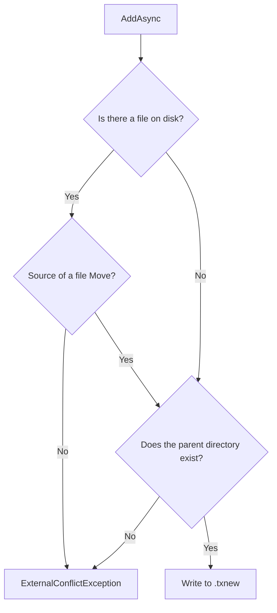
```mermaid
flowchart TD
  add["AddAsync"] --> exists{"Is there a file on disk?"}
  exists -->|Yes| moved{"Source of a file Move?"}
  moved -->|No| ext["ExternalConflictException"]
  moved -->|Yes| parent{"Does the parent directory exist?"}
  exists -->|No| parent
  parent -->|No| ext
  parent -->|Yes| ok["Write to .txnew"]
```

## UpdateAsync

`UpdateAsync` writes the new content of an existing file to `.txnew`. The real file keeps the old content until commit. The commit replaces the real file; discard deletes only the `.txnew`, and the real file keeps the old content. Without the marker, the `.txnew` is deleted; after the marker, it is skipped if it matches After and re-run if it matches Before. If neither, `ConflictDetected`.

When `detectExternalChanges` of `BeginAsync` is true, for file Update, file Delete, and the source of a file Move, it remembers the size and last write time (UTC) at staging (or at an earlier `ReadAsync`). Before commit, if that real file is still a file and either value differs, the result is `Failed`, and the real file does not change. The reason is `ExternalChange`. The default, false, does not fail an Update whose contents alone changed, and Before is the disk at commit time. A rewrite with the same size and the same last write time is missed (FAT rounds times to 2 seconds, and some SMB servers to seconds). Changes under a directory are not checked. The record is only in memory and is not written to the journal. `ReadAsync` updates the record each time it reads a real file. Reading this transaction's `.txnew` does not update it. A path with a Read record does not update the record when staged again.

It holds the whole work folder as shared, and locks the file. It reports every 81920 bytes.

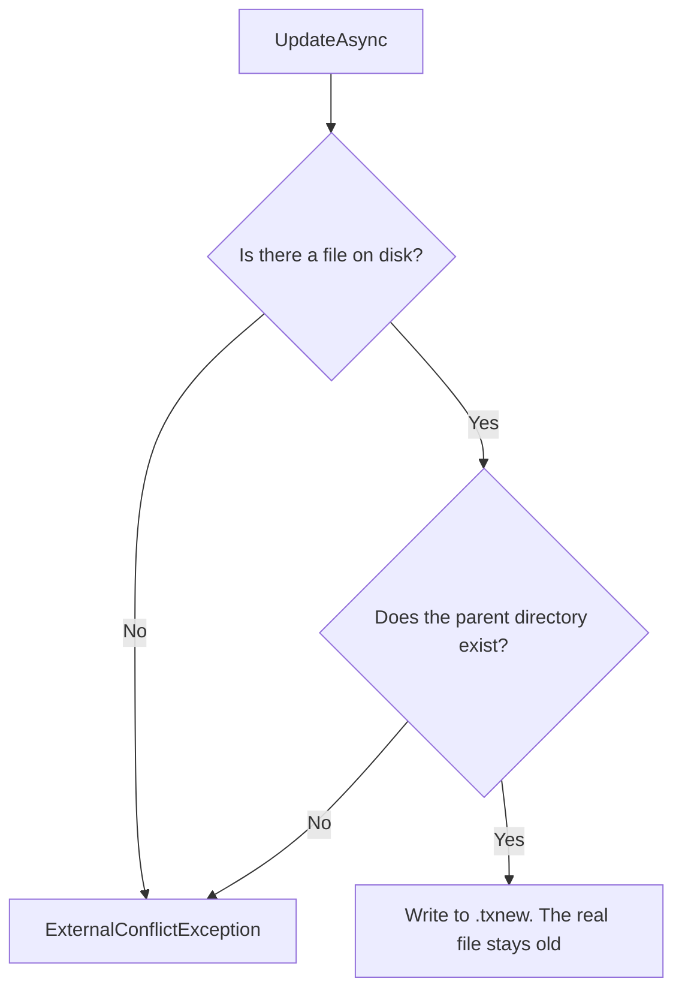
```mermaid
flowchart TD
  upd["UpdateAsync"] --> exists{"Is there a file on disk?"}
  exists -->|No| ext["ExternalConflictException"]
  exists -->|Yes| parent{"Does the parent directory exist?"}
  parent -->|No| ext
  parent -->|Yes| ok["Write to .txnew. The real file stays old"]
```

## Text and JSON

For a small string, use `WriteAllTextAsync`. Add if the post-commit view has no file, Update if it has one. The destination of a file `Move` gets Update; for a file, it folds into an Add at the destination and a Delete of the original. The source of a file `Move` gets Add. Both the destination and the source of a directory `Move` fail. After `Delete`, Add is chosen at that moment, but the record is Update. Writing to the same path again keeps one scheduled operation and replaces only the content.

```csharp
await tx.WriteAllTextAsync("new.txt", "hello");
await tx.WriteAllTextAsync("a.txt", "replaced");
await tx.WriteAllLinesAsync("lines.txt", new[] { "a", "b" });
```

`WriteAllLinesAsync` adds `Environment.NewLine` after each line. The elements of the array read back contain no line breaks. `WriteAllLinesAsync` with null `contents` throws `ArgumentNullException`. `WriteAllTextAsync` with null writes an empty file. A write without an encoding uses UTF-8 without a BOM, and a read uses the BOM if there is one.

JSON writes are the same Add and Update. Without options, `System.Text.Json` defaults apply, so property names stay as they are. Broken JSON stays `JsonException`.

```csharp
sealed record Note(string Title);

await tx.WriteAsJsonAsync("note.json", new Note("hello"));
Note? note = await tx.ReadFromJsonAsync<Note>("note.json");
```

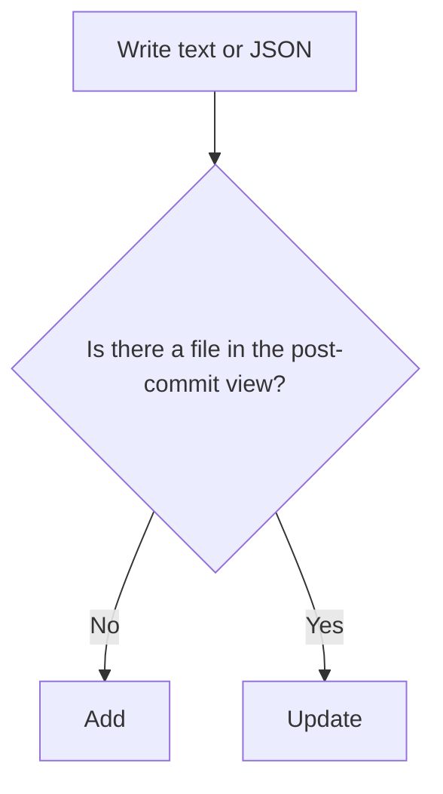
```mermaid
flowchart TD
  write["Write text or JSON"] --> exists{"Is there a file in the post-commit view?"}
  exists -->|No| add["Add"]
  exists -->|Yes| upd["Update"]
```

## ReadAsync

`ReadAsync` returns a read stream at position 0. The caller disposes it. This transaction's scheduled changes are read in the post-commit view: `Add` and `Update` read the `.txnew`, the destination of a file `Move` reads the source's bytes, and the source and the target of a `Delete` are missing. Everything under a `DeleteTree` and under the source of a directory `Move` is missing too. Under the destination, it is the corresponding file under the source. No locks are taken, and nothing goes into the journal.

`ExistsAsync` returns as a bool whether a file or directory exists in the same view. A missing path is false, and a directory never makes it fail.

The commit's rename proceeds even before the stream is closed. Rewriting the same path while the stream is open may fail. `ReadAllTextAsync` and `ReadAllLinesAsync` turn the same bytes as this read into a string or an array of lines.

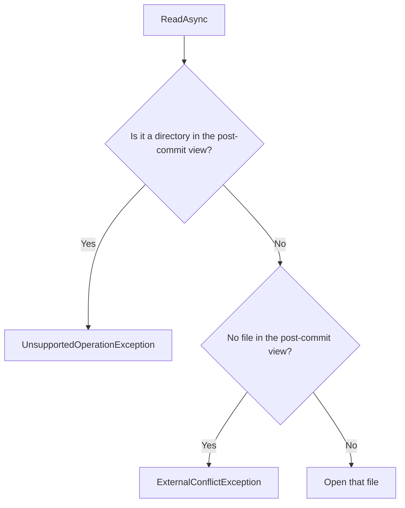
```mermaid
flowchart TD
  read["ReadAsync"] --> dir{"Is it a directory in the post-commit view?"}
  dir -->|Yes| uns["UnsupportedOperationException"]
  dir -->|No| bytes{"No file in the post-commit view?"}
  bytes -->|Yes| ext["ExternalConflictException"]
  bytes -->|No| ok["Open that file"]
```

## DeleteAsync

`DeleteAsync` only schedules the delete; the disk changes at commit. For a file it deletes that file, and for a directory it deletes only the direct children. An empty directory can be scheduled in one call. Discard does not delete the scheduled target. Without the marker, the disk does not change; after the marker, it is deleted if still there, applied if already gone, and `ConflictDetected` if it was swapped for a file.

For a file, it holds the whole work folder as shared and locks that file. For a directory, it holds the whole work folder as shared, locks that directory, and holds its intent lock exclusively until the end. Child paths are not locked. If another transaction stages under it, that transaction gets `LockContentionException` with `Path` set to that directory. When a direct child is not scheduled, the message is "The directory has a child that is not scheduled". To delete the following tree by direct children only, schedule from the deepest part.

```text
tree/
  child/
    a.txt
```

```csharp
await tx.DeleteAsync("tree/child/a.txt");
await tx.DeleteAsync("tree/child");
await tx.DeleteAsync("tree");
```

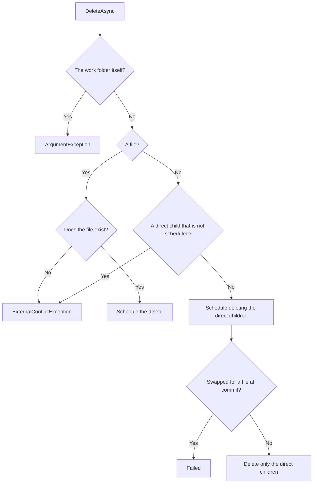
```mermaid
flowchart TD
  del["DeleteAsync"] --> self{"The work folder itself?"}
  self -->|Yes| arg["ArgumentException"]
  self -->|No| kind{"A file?"}
  kind -->|Yes| file{"Does the file exist?"}
  file -->|No| ext["ExternalConflictException"]
  file -->|Yes| reserve["Schedule the delete"]
  kind -->|No| child{"A direct child that is not scheduled?"}
  child -->|Yes| ext
  child -->|No| dreserve["Schedule deleting the direct children"]
  dreserve --> swap{"Swapped for a file at commit?"}
  swap -->|Yes| failed["Failed"]
  swap -->|No| gone["Delete only the direct children"]
```

## DeleteTreeAsync

`DeleteTreeAsync` schedules deleting a directory and everything under it as one entry. Staging does not walk the tree; the recursive delete happens at commit. Discard leaves the tree. Without the marker, the disk does not change; after the marker, the directory is deleted if still there, applied if already gone, and `ConflictDetected` if it was swapped for a file. Leftovers inside are deleted too, so the caller runs `RecoverAsync` first.

It holds the whole work folder as shared. It holds that directory's intent lock exclusively until the end, and does not lock child paths.

```csharp
await tx.DeleteTreeAsync("tree");
```

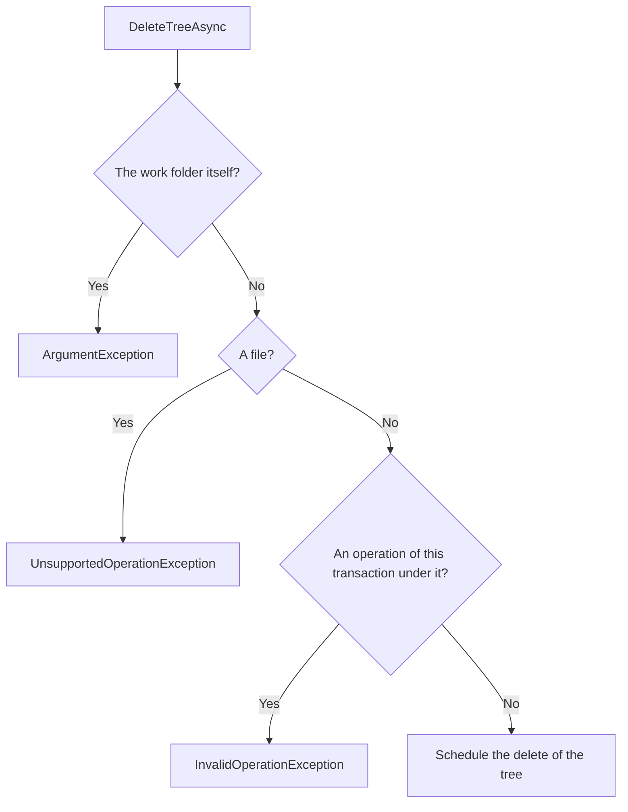
```mermaid
flowchart TD
  tree["DeleteTreeAsync"] --> self{"The work folder itself?"}
  self -->|Yes| arg["ArgumentException"]
  self -->|No| file{"A file?"}
  file -->|Yes| uns["UnsupportedOperationException"]
  file -->|No| under{"An operation of this transaction under it?"}
  under -->|Yes| inv["InvalidOperationException"]
  under -->|No| ok["Schedule the delete of the tree"]
```

## MoveAsync

`MoveAsync` schedules moving a file or directory within one volume. The target stays in its original place until commit, and is renamed once at commit. The contents of a directory are not written to the journal; they go with the rename. Discard deletes nothing. Without the marker, the disk does not change; after the marker, it is skipped if it matches After and re-run if it matches Before. If neither, `ConflictDetected`.

For a file, it holds the whole work folder as shared and locks the source and destination. For a directory too, it holds the whole work folder as shared. It locks the source and destination, and holds their intent locks exclusively until the end. Another volume is not turned into copy and delete. Paths that differ only in case, or are exactly the same, throw `InvalidOperationException`; then nothing goes into the journal and no lock is taken. The destination is accepted only when it is free, or is already the source of another Move in this transaction. Calls go from the free end, and a cycle without a free end is not accepted. Apply also starts from that end, and an Add to the source of a file comes after that Move. A Move that overwrites an existing file happens only when you say so with `MoveAsync(oldPath, newPath, overwrite: true)`. The commit replaces it with one rename and copies no bytes (the destination's ACL becomes the source's). If this transaction has a Delete at the destination, that Delete folds into the replacing Move. No further operation is allowed on the source or destination of a replacing Move. With `overwrite: true` when the source or destination is a directory, it swaps the existing file or directory at the destination. The commit moves the existing one aside to `{name}.{txid}.txold`, renames, and deletes the `.txold`. When a file swaps out a directory, nothing remains under it in the post-commit view. The source may be a directory that `ImportAsync` or `CopyAsync` of the same transaction created (`ImportAsync(external, "site.new")` followed by `MoveAsync("site.new", "site", overwrite: true)`). A `DeleteTreeAsync` at the destination folds into the swap. To change the kind at a path, prepare the new one under another name, then use this swap. `CreateDirectoryAsync` after `Delete`, and Add after `Delete` of an empty directory, are not accepted.

```csharp
await tx.MoveAsync("tree", "archive");
```

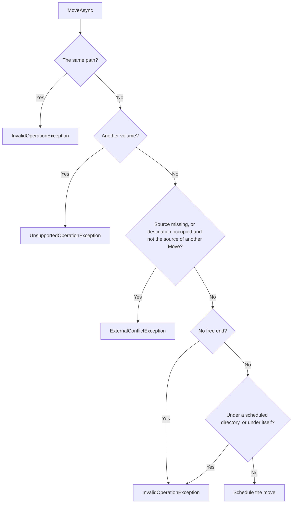
```mermaid
flowchart TD
  move["MoveAsync"] --> same{"The same path?"}
  same -->|Yes| invSame["InvalidOperationException"]
  same -->|No| vol{"Another volume?"}
  vol -->|Yes| uns["UnsupportedOperationException"]
  vol -->|No| place{"Source missing, or destination occupied and not the source of another Move?"}
  place -->|Yes| ext["ExternalConflictException"]
  place -->|No| cycle{"No free end?"}
  cycle -->|Yes| inv["InvalidOperationException"]
  cycle -->|No| under{"Under a scheduled directory, or under itself?"}
  under -->|Yes| inv
  under -->|No| ok["Schedule the move"]
```

## CreateDirectoryAsync

Only `CreateDirectoryAsync` creates an empty directory at the real path when called. Its contents are written with the plain file API, from the same process or another. Under it, the same operations work as under a directory whose parent existed from the start. The journal's `CreateDirectory` is one entry for the directory, and plain files are not walked. `GetPendingChanges` shows the operations scheduled under it.

When the commit is `Succeeded`, the directory stays in place and is not renamed. Discard deletes it, including the `.txnew` files inside and whatever the plain file API wrote. Without the marker, recovery does the same delete, or nothing if it is missing. After the marker, the directory is kept if it exists, and `ConflictDetected` if it is missing or is a file.

It holds the whole work folder as shared and locks the directory. It does not reserve what is under it, so other transactions can stage children. Operations under it also take their own locks. Delete, DeleteTree, Move, Update, or a second `CreateDirectoryAsync` on the path itself are not folded. The directory can be a copy source only when this transaction has no operation under it.

```csharp
await using ITransaction tx = await Txfio.BeginAsync(@"D:\share\work");
await tx.CreateDirectoryAsync("drop");
await File.WriteAllTextAsync(@"D:\share\work\drop\a.txt", "from-api");
await tx.WriteAllTextAsync(@"drop\b.txt", "from-txfio");
CommitReport report = await tx.CommitAsync();
```

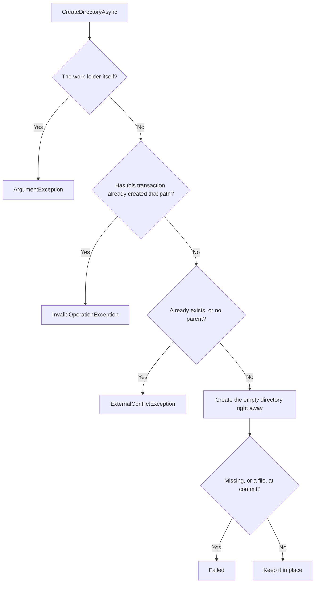
```mermaid
flowchart TD
  mk["CreateDirectoryAsync"] --> self{"The work folder itself?"}
  self -->|Yes| arg["ArgumentException"]
  self -->|No| again{"Has this transaction already created that path?"}
  again -->|Yes| inv["InvalidOperationException"]
  again -->|No| blocked{"Already exists, or no parent?"}
  blocked -->|Yes| ext["ExternalConflictException"]
  blocked -->|No| made["Create the empty directory right away"]
  made --> commit{"Missing, or a file, at commit?"}
  commit -->|Yes| failed["Failed"]
  commit -->|No| keep["Keep it in place"]
```

## CopyAsync

`CopyAsync` copies a file or directory inside the work folder to another place inside the work folder. The source stays. Bytes are copied even on the same volume; it is never a rename or a hard link. A file leaves the destination's `.txnew` as an Add; a directory turns each file on disk into an Add and creates empty subdirectories too. Uncommitted Adds are not on disk under their real names, so they are not included. Junctions and symbolic links are not followed.

After commit, the destination remains, and so does the source. On failure, cancellation, or discard without commit, the half-written `.txnew` and the directories this operation created are deleted. If a named path is a reparse point, it throws `InvalidOperationException` with the message "A reparse point cannot be used". For a file, it holds the whole work folder as shared and locks the source and destination. For a directory too, it holds the whole work folder as shared. It locks the source and destination, not the children. The destination's intent lock is exclusive until the end. The source's intent lock is exclusive only during the call, and closed when it ends. It reports every 81920 bytes. A directory's total size is not measured, so `TotalBytes` is null.

```csharp
await tx.CopyAsync("src", "dest");
```

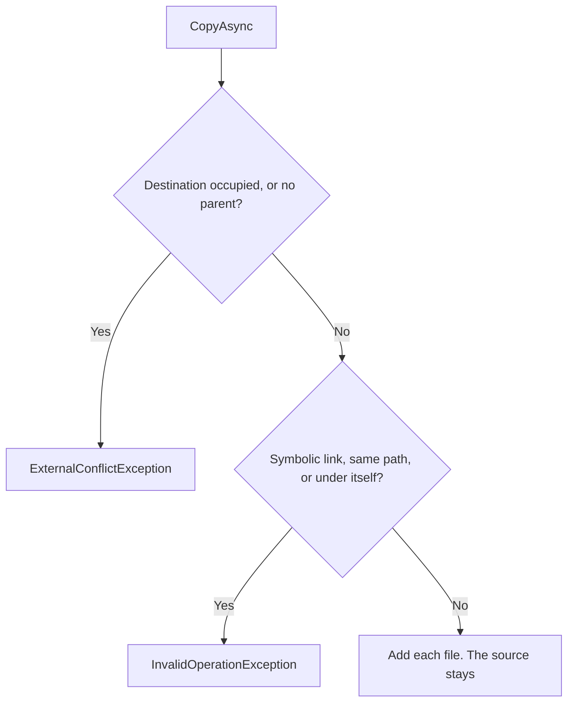
```mermaid
flowchart TD
  copy["CopyAsync"] --> blocked{"Destination occupied, or no parent?"}
  blocked -->|Yes| ext["ExternalConflictException"]
  blocked -->|No| bad{"Symbolic link, same path, or under itself?"}
  bad -->|Yes| inv["InvalidOperationException"]
  bad -->|No| add["Add each file. The source stays"]
```

## ImportAsync

`ImportAsync` copies a file or directory outside the work folder into `.txnew` files inside, and keeps them as Adds. The source is not deleted. This operation creates the destination directory itself and its empty subdirectories. On failure, cancellation, or discard, the half-written `.txnew` and the directories this operation created are deleted.

Junctions and symbolic links are not followed. For a file, it holds the whole work folder as shared and locks only the destination. For a directory too, it holds the whole work folder as shared. It locks only the destination, and holds its intent lock exclusively until the end. It reports every 81920 bytes. For a directory, `TotalBytes` is null.

```csharp
await tx.ImportAsync(@"D:\incoming\drop", "imported");
```

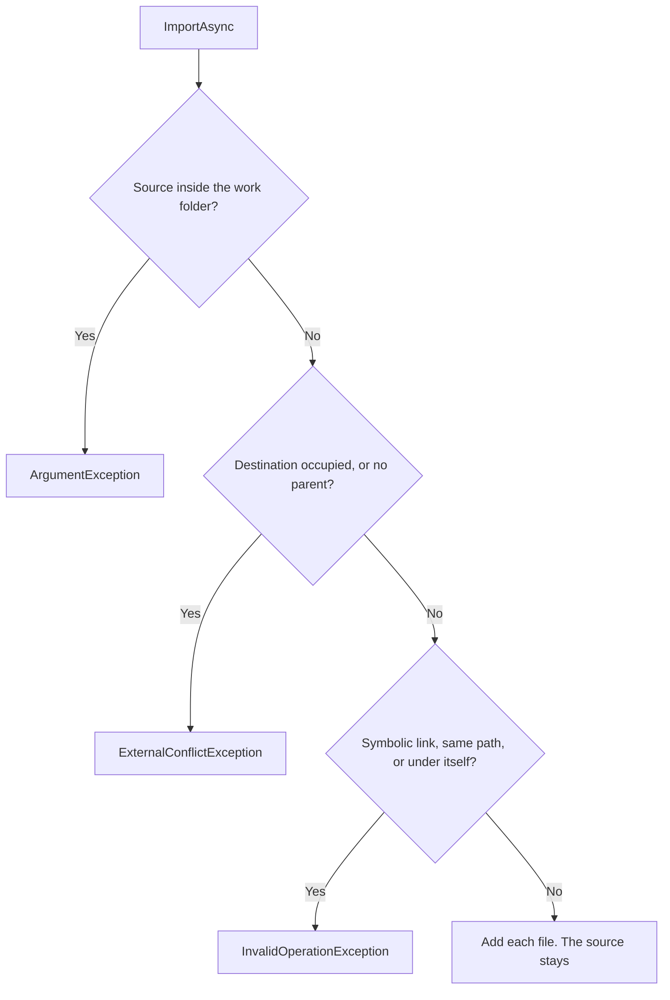
```mermaid
flowchart TD
  imp["ImportAsync"] --> inside{"Source inside the work folder?"}
  inside -->|Yes| arg["ArgumentException"]
  inside -->|No| blocked{"Destination occupied, or no parent?"}
  blocked -->|Yes| ext["ExternalConflictException"]
  blocked -->|No| bad{"Symbolic link, same path, or under itself?"}
  bad -->|Yes| inv["InvalidOperationException"]
  bad -->|No| add["Add each file. The source stays"]
```

## ExportAsync

`ExportAsync` copies the same bytes as a read to outside the work folder: one file, or each file under a directory. Nothing goes into the journal, no file in the work folder changes, and nothing is locked. Uncommitted Adds are not included. Exporting a file that has an Update gives the new content of the `.txnew`, while the real file on disk stays old.

Junctions and symbolic links are not followed. A destination that succeeded stays even after discard. On failure or cancellation, what was partly created outside is deleted. The commit does not change anything outside, and recovery does not cover it either. It reports every 81920 bytes. For a directory, `TotalBytes` is null.

```csharp
await tx.ExportAsync("src", @"D:\outgoing\copy");
```

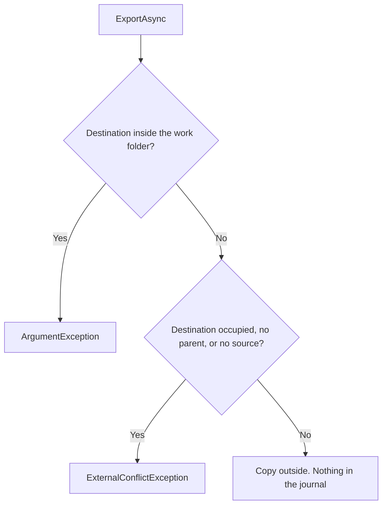
```mermaid
flowchart TD
  exp["ExportAsync"] --> inside{"Destination inside the work folder?"}
  inside -->|Yes| arg["ArgumentException"]
  inside -->|No| missing{"Destination occupied, no parent, or no source?"}
  missing -->|Yes| ext["ExternalConflictException"]
  missing -->|No| out["Copy outside. Nothing in the journal"]
```

## ZIP archives

ZIPs are read and written with `System.IO.Compression`, and join the same transaction as other operations. Inside and outside the work folder are told apart as with Copy / Import / Export. Passing a path on the wrong side throws `ArgumentException`. When the ZIP path or the destination already exists, or has no parent, it throws `ExternalConflictException`; nothing is overwritten or merged.

| API                   | Reads                                                       | Writes                                                       | Locks                                                                                                                   |
| --------------------- | ----------------------------------------------------------- | ------------------------------------------------------------ | ----------------------------------------------------------------------------------------------------------------------- |
| `CreateArchiveAsync`  | Files on disk, as `CopyAsync` does                          | A ZIP inside, as one Add                                     | The whole work folder as shared, plus the source and ZIP. The input directory has an exclusive intent lock only during the call. What is under it is not reserved |
| `ExportArchiveAsync`  | The same bytes as a read. Includes Update content           | A ZIP outside. A ZIP that succeeded stays even after discard | None                                                                                                                    |
| `ExtractArchiveAsync` | A ZIP inside, with the same bytes as a read. Uncommitted OK | A new directory, with an Add per file                        | The whole work folder as shared. The destination is locked, and its intent lock is exclusive until the end              |
| `ImportArchiveAsync`  | A ZIP outside                                               | Same as above                                                | Same as above                                                                                                           |

When creating, you can choose the `CompressionLevel` (default `Optimal`) and whether to include the directory name as the root of the entries (default: not included). Empty subdirectories become directory entries, and the entry time is the last write time of the source file. Entry names are written in UTF-8. Progress is bytes before compression, and `TotalBytes` is null.

To choose what goes in and under which name, pass a sequence of `ArchiveEntrySource`. Both Create and Export accept it. Without a name, it is the path relative to the work folder; an empty string for a directory puts its contents at the root of the ZIP. A directory adds everything under it recursively. Entries in the ZIP follow the order of the list. The same file may be added twice under different names. An empty list gives an empty ZIP. Names are checked by the same rules as extract (the paragraph below), and a match throws `ArgumentException`. The whole work folder stays shared, and directory elements are held with an exclusive intent lock only during the call. What is under the input is not reserved.

```csharp
await tx.ExportArchiveAsync(
    new[]
    {
        new ArchiveEntrySource(@"reports\2026-09.csv", "monthly/09.csv"),
        new ArchiveEntrySource("assets", ""),
    },
    @"D:\outgoing\bundle.zip");
```

Like `ExportAsync`, `ExportArchiveAsync` does not include uncommitted Adds for a directory. If you pass the file directly, the added content goes in too.

When extracting, the last write time of each extracted file is set to the entry time. For old ZIPs without the UTF-8 flag (such as Shift_JIS names made on Windows), choose how to read names with `entryNameEncoding`. Progress is bytes after extraction, and `TotalBytes` is the total size of the entries.

On failure, cancellation, or discard, the half-written `.txnew` (for Export, the external ZIP) and the directories this operation created are deleted.

```csharp
await tx.ExportArchiveAsync("reports", @"D:\outgoing\reports.zip");
Encoding.RegisterProvider(CodePagesEncodingProvider.Instance);
await tx.ImportArchiveAsync(@"D:\incoming\drop.zip", "incoming", Encoding.GetEncoding(932), maxExtractedBytes: 1L << 30);
```

Extract checks every entry name before it starts writing. If even one matches the following, nothing is staged, the destination is not created, and it throws `InvalidDataException`: names that leave the destination (`..`, a leading `/`, a drive letter), names not valid in a Windows path (`<>:"|?*`, a trailing `.` or space, reserved names such as `CON` and `NUL`), names ending in `.txnew`, duplicates that differ only in case, and a file and a directory with the same name. A corrupt ZIP also throws `InvalidDataException`.

When you pass `maxExtractedBytes`, a ZIP whose declared total extracted size exceeds the limit throws `InvalidDataException` without staging anything. An uncompressed entry can yield more bytes than declared, so the same exception is thrown when the bytes actually read exceed the limit, and the partial output is deleted. Pass a limit for ZIPs received from outside, so that a ZIP with a high compression ratio does not fill the shared disk. When omitted, there is no limit.

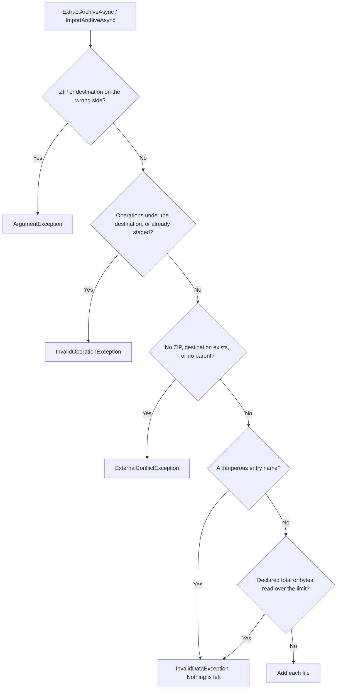
```mermaid
flowchart TD
  ext["ExtractArchiveAsync / ImportArchiveAsync"] --> side{"ZIP or destination on the wrong side?"}
  side -->|Yes| arg["ArgumentException"]
  side -->|No| busy{"Operations under the destination, or already staged?"}
  busy -->|Yes| inv["InvalidOperationException"]
  busy -->|No| blocked{"No ZIP, destination exists, or no parent?"}
  blocked -->|Yes| conflict["ExternalConflictException"]
  blocked -->|No| names{"A dangerous entry name?"}
  names -->|Yes| data["InvalidDataException. Nothing is left"]
  names -->|No| size{"Declared total or bytes read over the limit?"}
  size -->|Yes| data
  size -->|No| add["Add each file"]
```

## Calling the same path again

When you call the same path again, the scheduled operations fold into one as follows. Combinations not in the diagram throw `InvalidOperationException` with the message "This path is already staged by another operation". Operations under a `DeleteTreeAsync`, and under the source and destination of a directory Move, throw the same exception. Under a `CreateDirectory`, each branch of this diagram applies.

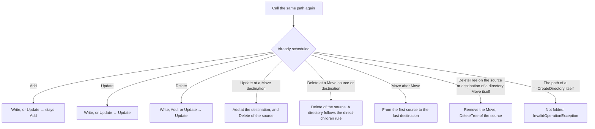
```mermaid
flowchart TD
  again["Call the same path again"] --> kind{"Already scheduled"}
  kind -->|Add| add["Write, or Update → stays Add"]
  kind -->|Update| upd["Write, or Update → Update"]
  kind -->|Delete| del["Write, Add, or Update → Update"]
  kind -->|Update at a Move destination| fold["Add at the destination, and Delete of the source"]
  kind -->|Delete at a Move source or destination| back["Delete of the source. A directory follows the direct-children rule"]
  kind -->|Move after Move| chain["From the first source to the last destination"]
  kind -->|DeleteTree on the source or destination of a directory Move itself| tree["Remove the Move, DeleteTree of the source"]
  kind -->|The path of a CreateDirectory itself| stop["Not folded. InvalidOperationException"]
```

## Telling exceptions apart

Commit success or failure is not an exception. Check `CommitReport.Result`. Rejected and skipped operations are in `Operations`. Other failures are exceptions. The base is `TxfioException`.

| Situation                                                                                                   | Type                            |
| ----------------------------------------------------------------------------------------------------------- | ------------------------------- |
| The target is missing, already exists, has no parent, a directory has an unexpected direct child, or the copy destination is occupied | `ExternalConflictException`     |
| Reading a directory, `DeleteTreeAsync` on a file, a Move across volumes                                     | `UnsupportedOperationException` |
| Already staged by another operation, Move or Copy under itself, a reparse point inside                     | `InvalidOperationException`     |
| The path is outside the work folder, the Import source is inside, the Export destination is inside         | `ArgumentException`             |
| Another Txfio holds the path or the work folder                                                             | `LockContentionException`       |
| A crashed journal remains (call `RecoverAsync` first)                                                       | `RecoveryRequiredException`     |
| Cannot be read as JSON                                                                                      | `JsonException`                 |
| A dangerous ZIP entry name, or a corrupt ZIP                                                                | `InvalidDataException`          |

`ExternalConflictException` and `LockContentionException` have one failed path. The `Path` of `RecoveryRequiredException` is the work folder.

## TxFileManager and SQLite

- **Txfio** (this library)
- **[TxFileManager](https://github.com/chinhdo/txFileManager)** (NuGet `TxFileManager`). A library that enlists file operations in `System.Transactions`. It is not Windows TxF. Microsoft has deprecated TxF, and that library does not use it
- **Keeping the data in SQLite**. Instead of a file tree, put rows and BLOBs into one database file

### When Txfio is better

When the real files must stay on a slow file server. The commit is a rename, not a second copy, and moving a directory does not walk its children. The journal stays in the work folder, so after a crash `RecoverAsync` can clean up. Moving large directories and `DeleteTreeAsync` avoid a backup copy to a temporary folder.

### When it is worse

When an SQL INSERT and a file creation must be one transaction that both roll back after a crash. That is the domain of TxFileManager and `TransactionScope`; this library does not enlist. Note, though, that TxFileManager has no file recovery after a crash.

When the data does not need to be ordinary files after commit, and you want consistency for searches and concurrent reads, SQLite is simpler. If existing tools on the shared folder must open the files directly, putting them into SQLite takes the files away from those users.

It also does not fit when other processes must never see an intermediate state during a commit. Several files are applied one operation at a time. If visible `.txnew` files, or the plain file API ignoring the locks, are not acceptable, it does not fit either.

| Criterion                     | Txfio                                                                                                                                                            | TxFileManager                                                                              | Data in SQLite                                                              |
| ----------------------------- | ---------------------------------------------------------------------------------------------------------------------------------------------------------------- | ------------------------------------------------------------------------------------------ | --------------------------------------------------------------------------- |
| What remains after commit     | Ordinary files and directories                                                                                                                                   | Ordinary files and directories                                                             | A database file. Not individual files                                       |
| When changes are visible      | The real paths keep the old state until commit. `.txnew` is visible                                                                                              | Applied the moment you call. Isolation is Read Uncommitted                                 | Other connections see the committed state                                   |
| Crash                         | The journal remains. `RecoverAsync` rolls back or forward                                                                                                        | Recovery is volatile. A crash leaves file operations half done                             | The DB recovers with its journal or WAL. Files outside the DB are not covered |
| Several targets at once       | During commit, some are new. `Failed` does not change the real files                                                                                             | Changes are visible immediately. A rollback of multi-file Moves stopping partway has been reported | Changes in the DB line up in one commit                              |
| Deleting a whole directory    | `DeleteTreeAsync`. Staging does not walk; recursive delete at commit. `DeleteAsync` is direct children only                                                     | `DeleteDirectory`. Moves it to temp when called                                            | Delete the rows that represent paths with SQL. Not a file tree delete       |
| Moving a directory            | One rename within a volume. Across volumes is an error                                                                                                           | `MoveDirectory`. Immediate. Copy and delete if temp is on another volume                   | Update a path column                                                        |
| Temporary location            | None. `.txnew` is in the same directory                                                                                                                          | `Path.GetTempPath()` by default                                                            | The database file itself                                                    |
| Shares on SMB                 | Supported. Durability of the server cache is not guaranteed                                                                                                      | Not the main target of the design                                                          | Placing it on a network share is not supported                              |
| Same transaction as a DB      | Does not enlist                                                                                                                                                  | Can enlist with `TransactionScope`                                                         | Only inside the database                                                    |
| Concurrency                   | Per path between users. What is under a directory is reserved with intent locks (`CreateDirectoryAsync` and ZIP creation do not reserve). Only `RecoverAsync` makes the whole work folder exclusive | Thread-safe according to its README. Isolation is Read Uncommitted                        | Writes are one connection as a rule. Reads can run in parallel with WAL and so on |
| Plain File API                | Cannot be stopped                                                                                                                                                | Cannot be stopped                                                                          | Reads and writes that bypass the DB are outside the transaction             |
| Platform                      | Guaranteed on Windows                                                                                                                                            | .NET Standard 2.0. Tested on Windows and Ubuntu                                            | Cross-platform                                                              |
| API shape                     | Async only. Copy progress                                                                                                                                        | Mostly synchronous                                                                         | Sync and async with `Microsoft.Data.Sqlite`                                 |

The TxFileManager features are based on its public README and `DeleteDirectoryOperation` (it moves the directory to temp, moves it back on rollback, and deletes temp recursively after commit). Its author says only volatile enlistment is supported, and that a process crash leaves things half done. The SQLite authors do not cover reliable operation on network file systems.

## Documentation

| Document                                     | Role                                 |
| -------------------------------------------- | ------------------------------------ |
| [`docs/design.md`](docs/design.md)           | Source of truth for the design       |
| [`docs/roadmap.md`](docs/roadmap.md)         | Implementation order (phases are provisional) |
| [`docs/conventions.md`](docs/conventions.md) | Coding conventions                   |
| [`docs/language.md`](docs/language.md)       | Language policy and translations     |
| [`CONTRIBUTING.md`](CONTRIBUTING.md)         | How to contribute                    |
| [`SECURITY.md`](SECURITY.md)                 | Reporting vulnerabilities            |

Japanese translations: [`README.ja.md`](README.ja.md), [`docs/design.ja.md`](docs/design.ja.md), [`docs/roadmap.ja.md`](docs/roadmap.ja.md), [`docs/conventions.ja.md`](docs/conventions.ja.md), [`CONTRIBUTING.ja.md`](CONTRIBUTING.ja.md).

## Local verification

On Windows, `./build.ps1` is the gate. Restore / format / build cover the whole solution, and the tests are the unit tests only. Run the stress tests explicitly with `dotnet test tests/Txfio.Stress/Txfio.Stress.csproj`. On Linux, do not run this script; run restore / format / build on the solution, then `dotnet test tests/Txfio.Tests/Txfio.Tests.csproj`. On Linux, Windows-only tests are skipped.

```powershell
./build.ps1
```

## License

[MIT](LICENSE)
